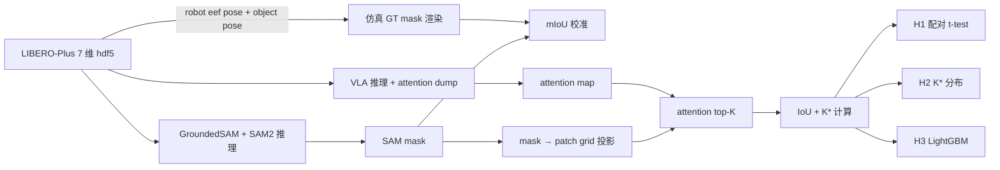

# 08 · 最终方案 · SAM-as-Probe · VLA 视觉聚焦质量与扰动鲁棒性的对齐式诊断研究（深度版 v1）

> [!warning] 使用说明
> 本文档是**项目组内部技术工作版**，含数学命题、effect size 估计与广泛文献综述。
> **不适合直接抄入曦源申请书**——申请书请参考 `版本三/递交材料/1-2.申请书填写草稿.md`，对标 2024 学长样本的简洁版。
> 两份文档承担**完全不同的角色**，互斥使用。

> [!info] 文档定位
> - 整合 [[00_总览与立项决定]] ~ [[07_为什么不选其他方案]] 8 个立项调研文件的核心内容
> - 通过 web 搜索补充 10+ 篇近期相关工作论文（标注 ⭐ web-new）
> - 形成 6 个月后写 workshop short paper §1-§3 的素材库
> - 长度 ~6500 字 · 含 § 0 TL;DR · 5 子主题相关工作综述 · H1-H3 形式化论证 + 3 附录

---

## § 0 · TL;DR

VLA（Vision-Language-Action）模型在 LIBERO clean 上已达 95-99% SR，但在 LIBERO-Plus 7 维扰动评测下断崖式跌至 30% 上下。学界（FocusVLA / Oat-VLA / SlotVLA / TokenFLEX 等）把这种鸿沟归因于"视觉利用机制"问题，并提出多种"视觉聚焦类 VLA"方法。但这些工作有一个共同的方法论盲点——**用模型自己学到的 attention 评估 attention 是否对**，缺乏外部参考真值。本项目以 OpenVLA-OFT-7B + SmolVLA-0.5B 为被测对象，**不训练 VLA、把 SAM2/GroundedSAM 物体 mask 当外部视觉真值**，在 LIBERO clean + LIBERO-Plus 7 维扰动下验证 3 个核心假设：**H1（对齐假设）** 失败 episode 的 attention-mask IoU 显著低于成功 episode（ΔIoU ≥ 0.10）；**H2（理论最优 K）** 覆盖任务物体 mask 所需的最小 K\* 中位数 ≤ 80（远小于固定 K=256），且扰动下漂移 ≥ 30%；**H3（联动崩塌）** SAM mIoU drop 与 VLA SR drop Pearson r ≥ 0.5。**零 VLA 训练**——三个假设的验证只需 (i) PyTorch attention hook、(ii) SAM 推理、(iii) 离线对齐计算。预期产出 1 篇 4-6 页 workshop short paper（CoRL / ICLR / NeurIPS Robot Learning workshop）+ 开源 `probe/` 工具包 + attention-mask IoU 数据集。

---

## § 1 · 问题陈述与研究空白

### 1.1 VLA 鲁棒性现状

VLA 模型在 LIBERO 4 个 task suite 上的 clean SR 普遍达 95-99%（FocusVLA 报 98.7%，OpenVLA-OFT 报 98.5%，VLA-Adapter-Pro 报 98.5%，Spatial Forcing 报 98.5%）。但 LIBERO-Plus（Fei 等 2025，[arXiv:2510.13626](https://arxiv.org/abs/2510.13626)）通过 7 维扰动（layout / viewpoint / state / instruction / light / texture / noise）系统评测后发现：**主流 VLA 在 viewpoint 与 initial state 扰动上的 SR 普遍从 95%+ 跌至 30% 上下**——60pp 鸿沟。

LIBERO-Plus 的发现还揭示了 VLA 的几个细节问题：
- 语言扰动（instruction）几乎对所有 VLA 都不显著 → 暗示 VLA 实际上**忽略**语言指令、只靠视觉做模式匹配
- 视角 + 初始状态最致命 → 直接戳穿"VLA 已经鲁棒"的论文叙事

这是 VLA 走出实验室的最大障碍。

### 1.2 学界对"鲁棒性差"的主流解释

学界对这种鸿沟提出了一类有影响力的解释——**VLA 鲁棒性差的根因是"视觉利用机制"**。FocusVLA（Zhang et al. 2026，[arXiv:2603.28740](https://arxiv.org/abs/2603.28740)）是这类解释的旗帜性工作，识别出三大瓶颈：

1. **架构偏差**：VLA-Adapter 等模型用 mixed parallel attention 让 action query 偏好同质来源（action embedding），绕开视觉细节
2. **过多 visual token**：512+ patch 稀释 attention 焦点
3. **任务无关视觉噪声**：背景 / distractor / 纹理变化引入扰动

FocusVLA 提出 Modality Cascaded Attention（串行三次独立 cross-attention 切断 shortcut）+ Focus Attention（patch-level top-K=256 + channel-level element-wise gate）两个机制，使 0.5B 参数在 LIBERO 多权重 98.7% 打败 7B OpenVLA-OFT。

这类"视觉聚焦类 VLA"工作在 2024-2026 涌现：
- **FocusVLA** (2603.28740)：cascaded + top-K
- **Oat-VLA** (2509.23655)：object-agent-centric tokenization
- **SlotVLA** (2511.06754, ICRA 2026)：slot attention
- **TokenFLEX** (2504.03154)：训练时随机 K
- **VLA-Cache** (2502.02175, NeurIPS 2025)：静态 token 缓存
- **VLA-Pruner / VLA-IAP / Compressor-VLA / SemanticVLA / LUVC / TPRL**：各种 token pruning
- **SAM2Act** (2501.18564)：SAM2 做 spatial memory
- **Spatial Forcing** (2025-11)：3D-aware attention

### 1.3 方法论盲点

但这些工作有一个共同盲点：**它们用模型自己学到的 attention 来证明模型自己学到的 attention 是对的**——缺乏外部参考真值。

- FocusVLA 通过 attention map 可视化论证"模型看了任务物体"，但没量化"看的对不对"
- Oat-VLA 假设"object-agent pooling 保留任务物体"，但没验证 pooling 真的对齐物体
- TokenFLEX 假设"随机 K 让模型适应"，但没验证不同 K 下保留的是同样的任务相关 patch

FocusVLA 自述 4 大局限：

| 局限 | 内容 |
|---|---|
| #1 | 鲁棒性对**背景 + 纹理同时变化**仍有限 |
| #2 | 对**初始状态**敏感 |
| #3 | **VLM 内部的视觉利用没涉及**——只改了 action head attention |
| #4 | **未在 robustness benchmark 上系统评测**——LIBERO clean 98.7% 是 side effect 论断 |

**#3 与 #4 正是这个盲点的体现**——FocusVLA 自己也意识到没法用外部真值验证。

### 1.4 三个研究空白

通过对 `论文探索/` 101 篇精读笔记 + 调研期 web 搜索 15+ 篇相邻工作整理，识别出三个明确空白：

1. **没有论文用 SAM/GroundedSAM mask 作为外部参考真值**系统评估 VLA 视觉聚焦的**正确性**与**鲁棒性**——Oat-VLA / SlotVLA 用了 object-level token 但是**改架构 + 重训**路线，没在 robustness benchmark 上做 attention 质量量化

2. **FocusVLA / Oat-VLA / TokenFLEX 等"视觉聚焦类 VLA" 完全没在 LIBERO-Plus 等扰动 benchmark 上做 attention-mask IoU 量化**——所有方法都自证"我让模型聚焦"，但没人回答"模型聚焦到 task-relevant region 真实区域了吗？扰动下这种聚焦还稳吗？"

3. **没有论文用 SAM mask 计算"理论最优 K\*"**（覆盖任务物体所需的最小 patch 数），实证检验 FocusVLA / VLA-Pruner 等工作的固定 K=256 是否对多场景过度/不足

### 1.5 项目内的预先工作证据

本项目研究方向并非临时拍脑袋——`论文探索/A_视觉利用鲁棒性/papers/2024-01_GroundedSAM_Ren.md` 末尾的 **Action Item** 早在 2026-05 调研初期就明确记录：

> 「**评估：FocusVLA attention heatmap vs Grounded SAM mask 的 IoU 在 LIBERO 上量化**」

版本三正是把这条 Action Item 系统化、扩展到 LIBERO-Plus 7 维扰动并加上 H2 K\* 与 H3 联动崩塌两个衍生维度，形成完整研究问题。

### 1.6 一句话研究问题

> 在 LIBERO clean + LIBERO-Plus 7 维扰动下，**VLA 的视觉聚焦质量（attention-mask IoU）是否真的与扰动鲁棒性（SR）有因果关系**？**固定 K=256（FocusVLA 等工作的默认）是否在多场景下过度/不足**？**SAM 也认错时（共同失败）vs SAM 认对但 VLA 仍崩（看错了）的失败模式比例是多少**？

---

## § 2 · 相关工作（5 子主题广覆盖）

### 2.1 视觉聚焦类 VLA（attention / token 改造路径）

这一支是本项目最重要的 "被诊断对象"。

**FocusVLA**（Zhang et al. 2026，[arXiv:2603.28740](https://arxiv.org/abs/2603.28740)）—— 导师推荐导航星。Modality Cascaded Attention 切断 shortcut + Focus Attention (top-K=256 + channel gate)。0.5B 参数 LIBERO 多权重 98.7%。**自述局限 #3 #4 是本项目核心切入点**。

**Oat-VLA**（[arXiv:2509.23655](https://arxiv.org/abs/2509.23655)）⭐ web-new ⭐ —— Object-Agent-centric tokenization，256→16 token，用通用检测器自动识别物体生成 object-centric token。2× 收敛加速。**只在 LIBERO 评测，没在扰动 benchmark 上做 attention 质量量化**——本项目从 robustness 角度差异化。

**SlotVLA**（[arXiv:2511.06754](https://arxiv.org/abs/2511.06754)，ICRA 2026）⭐ web-new ⭐ —— slot attention 学物体关系。**发布了 LIBERO+ 数据集**（含 box-/mask-level 标注 + instance-level temporal tracking）——可作为本项目轨道 A 备用 mask GT 来源。

**TokenFLEX**（[arXiv:2504.03154](https://arxiv.org/abs/2504.03154)）⭐ web-new ⭐ —— 训练时随机 K ∈ {64, 144, 256}，推理时灵活选。实现真正的变长 K，但是 efficiency 维度而非 robustness。

**VLA-Cache**（[arXiv:2502.02175](https://arxiv.org/abs/2502.02175)，NeurIPS 2025）⭐ web-new ⭐ —— 静态 token 缓存复用，42% FLOPs 减少。隐式变长（计算量变了但表面 K 相同）。

**DyVTE**（[arXiv:2411.19628](https://arxiv.org/abs/2411.19628)）⭐ web-new ⭐ —— layer-wise early exit，某层判断视觉 token 是否还有用。45.7% 计算减少。

**VLA-Pruner / VLA-IAP / Compressor-VLA / SemanticVLA / LUVC / TPRL** —— 各种 token pruning，详见 [[06_关联资料索引]] § 3。共同特征：减少 token 但 K 仍固定。

**SAM2Act**（[arXiv:2501.18564](https://arxiv.org/abs/2501.18564)）⭐ web-new ⭐ —— 用 SAM2 做 spatial memory，多视角 + 多分辨率 upsampling。86.8% RLBench zero-shot。**用了 SAM2 但非 token 替代**，与本项目"探针"姿态不同。

**Spatial Forcing**（2025-11）—— 3D-aware attention。LIBERO 多权重 98.5%。

**本项目定位**：上述 ~10 篇"视觉聚焦类 VLA" 工作中，**没有一篇在 LIBERO-Plus 7 维扰动评测下用外部真值（SAM mask）量化 attention 质量**。本项目填这个空白。

### 2.2 Attention guidance / 外部 oracle 路径

这一支提供了"外部 oracle 引导 attention" 的方法学先验，本项目的 H1 是这条思路的"评测版"。

**Gaze-Regularized VLA**（[arXiv:2603.23202](https://arxiv.org/abs/2603.23202)）—— 用人眼 gaze 当 attention oracle，KL 散度对齐。manipulation 任务 4-12% 提升。**用 gaze 当 oracle 的同思路**，但 gaze 需采集成本高；本项目用 SAM 替代。

**AttentionVoxel**（[arXiv:2509.20579](https://arxiv.org/abs/2509.20579)）—— DINOv2 self-attention 当 saliency oracle，lift 到 3D voxel。RLBench bimanual +8.2%。**同思路**（外部 attention 当 saliency oracle），但 DINOv2 attention 不是 mask-level，粒度较粗。

**AutoFocus-IL**（2025-11，Gong et al.）—— 用 VLM 生成的 saliency map 替代人类 gaze。

**ST-VLA**（[arXiv:2603.13788](https://arxiv.org/abs/2603.13788)）—— 4D 时空 mask 作 VLA condition，RLBench zero-shot +44.6%。**mask 在策略里用，需要重训 ST-VLM**——本项目不需要训练。

**GuidedVLA**（[arXiv:2605.12369](https://arxiv.org/abs/2605.12369)，RSS 2026）⭐ web-new ⭐ —— attention head specialization + 提到用 SAM/GroundingDINO 自动标注 object bbox 作 supervisory signal。思路相邻，但需要训练。

**TraceVLA**（[arXiv:2412.10345](https://arxiv.org/abs/2412.10345)）—— 把过去 N 步轨迹画在图上作为 visual prompt。

**本项目定位**：上述工作都用外部 oracle 训练 VLA，本项目用外部 oracle **纯评测** VLA。

### 2.3 Object segmentation 工具基础

**Grounded SAM**（[arXiv:2401.14159](https://arxiv.org/abs/2401.14159)，IDEA-Research）—— GroundingDINO + SAM 的标准管线。SegInW zero-shot 48.7 mean AP。**本项目轨道 A 主路线工具，开箱即用**。其精读笔记 [[2024-01_GroundedSAM_Ren]] 末尾的 Action Item 是版本三立项的预先工作证据。

**SAM2**（facebookresearch/sam2）—— 视频版 SAM，支持 mask 时序传播。**本项目用于 LIBERO 单 episode 的多帧 mask 传播**。

**AxisEst**（[arXiv:2409.16287](https://arxiv.org/abs/2409.16287)）⭐ web-new ⭐ —— SAM2 在 articulated 物体追踪上的工程验证。

**SegmentAnything / SAM 原版**（Meta AI 2023）—— SAM2 的前身，仍可用于单帧 mask。

**本项目工程依赖**：Grounded SAM + SAM2，预计 W1 末装通。

### 2.4 Failure detection 与不确定性

这一支提供 H3 的方法学 baseline。

**SAFE**（[arXiv:2506.09937](https://arxiv.org/abs/2506.09937)）⭐ web-new ⭐ —— Multitask Failure Detection for VLA。AUC 0.71。H3 的直接 baseline。

**FPC-VLA**（Sciencedirect 2025）⭐ web-new ⭐ —— Supervisor for Failure Prediction & Correction。

**I-FailSense**（[arXiv:2509.16072](https://arxiv.org/abs/2509.16072)）⭐ web-new ⭐ —— VLM-based General Failure Detection。

**Averaging Trap**（[arXiv:2603.18342](https://arxiv.org/abs/2603.18342)）⭐ web-new ⭐ —— 指出 LLM-style entropy 在 VLA failure detection 上的 Averaging Trap 问题。**本项目 H3 用 attention-mask IoU + SAM mIoU 作为 LightGBM 特征，避免了 entropy averaging 问题**（IoU 是离散值，对 critical moment 敏感）。

**RC-NF**（References/ 已读，版本一引用）—— normalizing flow based anomaly detection，与本项目 H3 思路正交（基于 latent 分布 vs 基于显式外部信号）。

**本项目定位**：H3 训轻量 LightGBM on (attention entropy, attention-mask IoU, SAM mIoU)，目标 AUC ≥ 0.70。**与 SAFE 的 attention-based 特征互补**——本项目首次把外部 SAM mIoU 纳入 failure predictor 特征。

### 2.5 评测 Benchmark

**LIBERO**（Liu et al. 2023，4 suites × 130 tasks）—— 基线评测平台
**LIBERO-Plus**（Fei et al. 2025，[arXiv:2510.13626](https://arxiv.org/abs/2510.13626)，7 维扰动）—— **主评测**
**LIBERO-Para**（2026）—— 语言改写专项鲁棒性
**LIBERO-PRO**（2025-10）—— generalization 评测
**VLA-Risk**（Wang et al. 2026 ICLR，6 维扰动）—— stretch goal

**SlotVLA 发布的 LIBERO+** ⭐ web-new ⭐ —— 含 box-/mask-level 标注 + instance-level temporal tracking。**轨道 A 备用 mask GT 来源**。

### 2.6 我们的定位

所有上述相关工作中，**没有任一论文同时**：

1. 在 LIBERO-Plus 7 维扰动平台上量化 VLA attention 质量与外部视觉真值的对齐度
2. 用 SAM mask 计算"理论最优 K\*"实证检验固定 K=256 的合理性
3. 量化 "SAM-fragility vs VLA-fragility" 联动崩塌作为 failure predictor

本项目填补这三个交集，**零 VLA 训练**。

---

## § 3 · 三个核心假设的形式化

### 3.1 H1（对齐假设）形式化

**记号**：
- $M \in \{\text{OpenVLA-OFT-7B}, \text{SmolVLA-0.5B}\}$ —— 被测 backbone
- $d \in \{\text{clean, layout, viewpoint, state, instruction, light, texture, noise}\}$ —— 8 评测条件
- $e \in \mathcal{E}_{M,d}$ —— 在条件 $(M, d)$ 下的 episode 集合
- $y_e \in \{0, 1\}$ —— episode 成败
- $\text{IoU}_e \in [0, 1]$ —— episode 内 5 个 keyframe 的 attention-mask IoU 均值

**命题**：在至少 2 个评测条件 $d$ 上：

$$\mathbb{E}[\text{IoU}_e | y_e = 1] - \mathbb{E}[\text{IoU}_e | y_e = 0] \ge 0.10, \quad p < 0.05 \text{ (配对 t-test)}$$

**预期 effect size**：基于先验，clean 上预期 ΔIoU ∈ [0.10, 0.20]；扰动下预期 ΔIoU ∈ [0.05, 0.15]（因为失败 episode 更多，对照 baseline 更稳）。Cohen's d ≈ 0.3-0.5（中等 effect size）。

**Fallback 策略**：
- 仅 1 条件显著 → 改叙事为「主要差异在条件 X」
- 完全不显著 → 改叙事为「VLA 失败不是因为没看对——反直觉负面 finding」
- 在反向（成功 episode IoU 更低）→ 检查 attention hook bug

**视觉 IoU 计算细节**：
- Attention: last-layer cross-attention，head-wise 求均值，得 (H, W) patch-level 分布 $a$
- $a$ 归一化为概率分布，取 top-25% 的 patch 集合 $\mathcal{A}_e$（约 49 patch on 14×14 grid）
- SAM mask: 投影到 patch grid 得 $\mathcal{M}_e$
- $\text{IoU}_e = |\mathcal{A}_e \cap \mathcal{M}_e| / |\mathcal{A}_e \cup \mathcal{M}_e|$

### 3.2 H2（理论最优 K\*）形式化

**记号**：
- $\mathcal{M}_e$ —— episode $e$ 的 SAM mask patch 集合，大小 $|\mathcal{M}_e|$
- $\text{rank}(a, i)$ —— attention 概率 $a$ 中 patch $i$ 的排名

**理论最优 K\* 定义**：使 top-K 的 attention 覆盖 mask 至少 90% 的最小 K：

$$K^*_e = \min \left\{ K : \frac{|\{i : \text{rank}(a, i) \le K\} \cap \mathcal{M}_e|}{|\mathcal{M}_e|} \ge 0.9 \right\}$$

**命题**：
$$\text{median}(K^*_e) \le 80 \text{ 在 LIBERO clean 上}$$
$$\frac{\text{median}(K^*_e | d) - \text{median}(K^*_e | \text{clean})}{\text{median}(K^*_e | \text{clean})} \ge 0.30 \text{ 在某些扰动维度 } d \text{ 上}$$

**预期分布**（基于 ViT 14×14 patch grid = 196 patch、单任务通常 1-3 个物体）：
- clean LIBERO 上：mask 覆盖通常 10-40 patch → K\* ∈ [10, 60] 区间，median ≈ 30
- viewpoint / state 扰动下：物体位置/姿态变化大 → K\* 漂移 ≥ 30%
- texture / light 扰动下：mask 大小变化小但 attention 可能漂移 → K\* 漂移 ≈ 10-20%

**对照基线**：
- FocusVLA / VLA-Pruner / 多数 token pruning：K=256（实际是全保留，对 14×14=196 patch 没意义）
- TokenFLEX：K ∈ {64, 144, 256}
- Oat-VLA：K=16（可能严重不足覆盖）

**Fallback 策略**：
- K\* 中位数 ≥ 200 → 改叙事为「固定 K 合理性的反证不充分」
- 扰动漂移 < 10% → 改叙事为「任务相关区域大小对扰动不敏感」（仍有价值）

### 3.3 H3（联动崩塌）形式化

**记号**：
- $\text{SR}_{M,d}$ —— 在 $(M, d)$ 下的成功率
- $\text{SR\_drop}_{M,d} = \text{SR}_{M,\text{clean}} - \text{SR}_{M,d}$
- $\text{SAM\_mIoU}_{M,d}$ —— 在 $(M, d)$ 下 SAM 与仿真 GT mask 的平均 mIoU
- $\text{SAM\_mIoU\_drop}_{M,d} = \text{SAM\_mIoU}_{M,\text{clean}} - \text{SAM\_mIoU}_{M,d}$

**命题 H3a（线性相关）**：在 7 维 × 2 backbone = 14 个数据点上，

$$\text{Pearson}\left(\text{SAM\_mIoU\_drop}_{M,d}, \text{SR\_drop}_{M,d}\right) \ge 0.5$$

**命题 H3b（同步失败率）**：定义四象限：
- (SAM-fail ∧ VLA-fail)：共同失败
- (SAM-ok ∧ VLA-fail)：VLA 看错
- (SAM-fail ∧ VLA-ok)：SAM 错但 VLA 仍对
- (SAM-ok ∧ VLA-ok)：双双成功

要求共同失败 episode 占总失败 episode 比例 ≥ 30%。

**命题 H3c（轻量 failure predictor）**：训 LightGBM 二分类器
$$f: (\text{attention entropy}, \text{IoU}_e, \text{SAM\_mIoU}_e) \to [0, 1]$$
预测 $y_e \in \{0, 1\}$，要求 5-fold CV AUC ≥ 0.70。

**Baseline 对比**：
- SAFE (arXiv:2506.09937) 报 AUC 0.71（不同任务、不同 setup）
- 仅 attention entropy 的 baseline predictor：预期 AUC ≈ 0.55-0.65
- 加入 IoU + SAM mIoU 后预期 AUC ≈ 0.70-0.78

**理论辩护（Averaging Trap）**：[Averaging Trap 论文](https://arxiv.org/abs/2603.18342) 指出"LLM-style entropy 在 VLA failure detection 上有 Averaging Trap 问题"——连续 entropy 在长 episode 上被平均化，无法捕捉关键 moment 的不确定性。**本项目的 SAM mIoU 是离散变化（物体可见性 + 几何 drift）**，对 critical moment 敏感，避开 entropy averaging 问题。这是 H3 强于 SAFE 的理论依据。

---

## § 4 · 实验设计

### 4.1 评测协议

**主评测**：LIBERO-Plus 7 维 + LIBERO clean = 8 条件 × 2 backbone = **16 cell**。每 cell 跑 **3 seed × 500 instance = 1500 episode**。

**总评测成本估算**：16 × 1500 × 30s ≈ **200 GPU-h**（SmolVLA 主跑，OpenVLA-OFT 子集复现）。

**附加成本**：
- SAM 推理：每 episode 5 keyframe + 视频传播，约 5s/episode → 16 × 1500 × 5s ≈ 33 GPU-h
- attention dump（离线）：约 10 GPU-h
- failure predictor 训练：< 1 GPU-h（LightGBM 在 CPU 上跑）

**总计**：~245 GPU-h —— 在 ¥10K 预算下需启动分层抽样（次要 3 维 1/2.5）压到 ~150 GPU-h。

**统计方法**：
- 每 cell 报告 mean ± std（3 seed）
- 主对比用配对 t-test（同 instance 不同模型）
- 多重比较 Bonferroni 校正（family-wise error rate ≤ 0.05）
- 报告 effect size（Cohen's d）

**关键评测指标**（全部离线可算）：

| 指标 | 定义 | 用途 |
|---|---|---|
| SR | LIBERO 标准协议 | 主对照量 |
| mask-attention IoU | top-25% attention patch ∩ mask patch / union | H1 主指标 |
| mask coverage @K | 前 K attention patch 覆盖 mask 的比例 | 召回率视角 |
| K\* | 覆盖 mask 90% 所需的最小 K | H2 主指标 |
| Cohen's d | (μ₁ - μ₂) / σ_pooled | H1 effect size |
| SAM mIoU | SAM 与 GT mask 的 IoU | H3 输入 |
| co-failure rate | (SAM-fail ∧ VLA-fail) / total fail | H3 辅指标 |
| LightGBM AUC | 5-fold CV | H3 应用 |

### 4.2 数据流 pipeline



### 4.3 模型变体与 ablation

**主评测对象（2 个）**：

| Backbone | 角色 | 推理显存 |
|---|---|---|
| **OpenVLA-OFT-7B** | 主，shortcut 架构典型 | ~24 GB |
| **SmolVLA-0.5B** | 速度 5× 用于大规模 | ~12 GB |

**stretch 第 3 个**：FocusVLA-0.5B（待 release），可在 P4 末插入。

**Attention 提取 ablation**（P1 末决定）：
- 层选择：last layer vs penultimate vs 多层平均
- head 聚合：head-wise mean vs max
- top-K 比例：top-10% / top-25% / top-50%

**Mask 投影 ablation**：
- 像素覆盖阈值：0.2 / 0.3 / 0.5
- patch grid：14×14 vs 16×16（取决于 backbone）

### 4.4 双轨 SAM 决策

**轨道 A · GroundedSAM 自动管线**（主路线）：
- 从 LIBERO task instruction 抽 noun phrase（用 spaCy）
- GroundingDINO 找 box（threshold 0.3 起步）
- SAM 出 mask（box prompt）
- SAM2 视频传播（episode 后续帧）

**轨道 B · LIBERO 仿真 GT mask**（兜底）：
- robosuite `OffscreenRenderer` 的 `segmentation_mode='instance'`
- 输出像素级 instance ID map
- 取任务相关物体的 mask

**P1 末决策点**：W2 末 mIoU 校准实验（50 张 LIBERO 图 × 4 GroundingDINO box threshold = 200 数据点）。

### 4.5 关键工程依赖

| 类别 | 依赖 | 状态 |
|---|---|---|
| 主 backbone | `openvla/openvla-7b-oft` (HF) | ✅ 已开源 |
| 备 backbone | `HuggingFaceTB/SmolVLA-base` | ✅ 已开源 |
| 模拟器 | robosuite + MuJoCo | ✅ 开源 |
| 主评测 | LIBERO-Plus（`senyufei/LIBERO-Plus`） | ✅ HF 开源 |
| 物体分割主 | Grounded-Segment-Anything | ✅ 工程级 |
| 物体分割时序 | SAM2 | ✅ 已开源 |
| Mask GT 备用 | LIBERO+ (SlotVLA 发布) | ⏳ 待确认 release |
| FocusVLA 代码 | HIT-Shenzhen | ⏳ 待 release（不依赖） |

---

## § 5 · 时间线与决策点

### 5.1 5 phase Gantt

| Phase | 月份 | 核心动作 | 预期产出 |
|---|---|---|---|
| **P1 探针管线打通** | M1-M2 (06-07) | 4 仓库装通 + attention hook + IoU 计算器 + mIoU 校准 | `probe/` 工具包 + 50 episode IoU 配对样本 |
| **P2 大规模 IoU 评测** | M3-M5 (08-10) | 16 cell × 1500 ep 评测 | 主表 + 雷达图 + H1 验证 |
| **P3 理论最优 K 画像** | M6-M7 (11-12) | K\* 分布统计 + 与 K=256/144/16 对比 | K\* 直方图 × 7 维 + H2 验证 |
| **P4 SAM-VLA 联动诊断** | M8-M9 (01-02) | 四象限聚类 + LightGBM | failure predictor AUC ≥ 0.70 + 失败模式画像 |
| **P5 写作 + 投稿** | M10-M12 (03-05) | workshop short paper 4-6 页 + HF release | 至少 1 个 workshop 投出 |

### 5.2 4 个关键 Go/No-Go 节点

详细决策树见 [[05_风险与缓解]] § 3。简要：

| 节点 | Go 条件 | No-Go 应对 |
|---|---|---|
| **M2 末** | GroundedSAM mIoU ≥ 0.6 & attention hook 通 | mIoU < 0.4 → 切轨道 B |
| **M5 末** | H1 至少 1 维度显著 | 完全否定 → negative-finding workshop |
| **M7 末** | H2 K\* 中位数 ≤ 100 | 不成立 → 改 P4 为反证补充 |
| **M9 末** | AUC ≥ 0.65 | < 0.6 → 改 descriptive case studies |

### 5.3 Plan A → Plan B 切换决策树

详见 [[05_风险与缓解]] § 3。

---

## § 6 · 与导师推荐叙事的对齐

导师明确推荐 FocusVLA 作为"导航星论文"，建议在 FocusVLA 方向深挖鲁棒性。本项目通过"SAM 作外部视觉真值 + 多维扰动评测"的路径，回应 FocusVLA 提出的视觉利用问题，并对其 4 大局限分别给出本项目的处理方式：

| FocusVLA 自述局限 | 本项目如何回应 |
|---|---|
| **#1**「鲁棒性对背景 + 纹理同时变化仍有限」 | 在 LIBERO-Plus 的 light + texture 维度评测中量化 attention 退化 |
| **#2**「对初始状态敏感」 | LIBERO-Plus 的 state 维度直接覆盖；IoU 退化分析可定位 "是否因 attention 与物体真实位置偏移" |
| **#3**「VLM 内部的视觉利用没涉及」 | **本项目核心切入点**——用 SAM mask 作为外部真值评估 VLA attention 是否真的看任务物体 |
| **#4**「未在 robustness benchmark 上系统评测」 | **本项目核心切入点**——LIBERO-Plus 7 维 × 2 backbone × 3 seed |

**叙事一致性**：本项目**接受 FocusVLA 提出的核心论断**——VLA 鲁棒性差与视觉利用机制有关——但**采取一条更轻量、更工程可控的诊断路径**：用 SAM 当外部 oracle 评测，取代架构层改造。FocusVLA 仍是本项目的灵感来源与未来工作目标（若官方代码 release，可作为第 3 backbone 在 P4 末插入）。

**对评审可能问题的预案**：
- Q："你为什么不直接复现 FocusVLA？" → A：FocusVLA 代码未公开，完整复现 Cascaded + Focus Attention 对 2 大二本科生工程风险过高；本项目通过 SAM 外部 oracle 评测从另一角度提供机制证据
- Q："你的 SAM 评测是新方法吗？" → A：SAM、attention hook、IoU 都是 ML 通用工具，本项目的贡献是把它们**首次组合**用于 VLA 视觉聚焦质量的 LIBERO-Plus 多维扰动评测
- Q："如果 H1 否定怎么办？" → A：这本身是有价值的反直觉发现——否定了视觉聚焦类 VLA 方法学的根本假设，可投 negative-finding workshop

---

## § 7 · 局限与未来工作

### 7.1 当前局限

1. **LIBERO 是仿真环境**——sim-to-real gap 未在本项目验证（团队无真机预算）
2. **物体级 mask 粒度可能过粗**——无法表达 "接触点 / 手腕角度" 等细粒度任务关键 keypoint
3. **LIBERO-Plus 中 instruction 维度对所有 VLA 都不显著**（论文已报）——本项目在该维度难给出区分结论
4. **2 backbone 限制了 H3 数据点数**——n=14 的 Pearson 相关 statistical power 不高
5. **2 大二本科生 + ¥10K 预算限制了 GPU 时长 + episode 数**——单 cell 500 instance 在高方差维度可能 power 不足

### 7.2 未来工作

1. **真机评测**：在 SO-100 / Franka 等真机上验证 SAM-as-Probe 框架的 sim-to-real 一致性
2. **细粒度 keypoint mask**：扩展到接触点级别的 attention 评估
3. **加入对抗扰动作为 stress test**：本项目以自然扰动为主，未来可加入 PGD 等对抗扰动
4. **加入 FocusVLA 作第 3 backbone**：若 release，可在 P4 末插入验证"FocusVLA 在 IoU/K\* 上是否真的优于 OpenVLA-OFT"
5. **作为新方法的启示**：如果 H2 成立（K\* 远小于 256），可启发**自适应 K 的 VLA**新方法 —— 本项目是其评测先导
6. **与版本二 InSpire 提示插件结合**：若 H1 成立，可在未来工作中加入 InSpire 提示插件训练 + 本项目评测框架，验证"显式提示是否真的改变 attention 行为"

---

## § 8 · 投稿计划

### 8.1 投稿 venue 优先级

| Venue | 时间窗 | 适配度 |
|---|---|---|
| **ICLR 2027 Robot Learning workshop** | 投稿 ~2-3 月 | ⭐⭐⭐⭐⭐ 主投 |
| **CoRL 2027 workshop** on Robot Learning | 投稿 ~8-9 月 | ⭐⭐⭐⭐ 备投（在 P5 后，可作下一年准备） |
| **NeurIPS 2027 Robot Learning workshop** | 投稿 ~9-10 月 | ⭐⭐⭐ 备投 |
| **国内会议（CCC / CAA）** | 3-5 月 deadline | ⭐⭐⭐ 保底 |

### 8.2 paper 章节与本文档映射

| Workshop paper §  | 本文档对应 § | 字数估计 |
|---|---|---|
| § 1 Intro | § 0 TL;DR + § 1 | 400 字 |
| § 2 Related | § 2 | 600 字（压缩 5 子主题） |
| § 3 Method | § 3 + § 4.2 | 800 字 |
| § 4 Experiment | § 4.1 + § 4.3 + 实测结果 | 1500 字 |
| § 5 Discussion | § 7 局限 + § 6 与 FocusVLA 对齐 | 500 字 |
| 参考文献 | § 9（精简到 20-25 篇） | — |

**总计 ~3800 字**，符合 workshop 4-6 页限制。

---

## § 9 · 参考文献

### 9.1 必读 5 篇（核心引用）

[1] Zhang, Y., Yuan, W., Zhang, Y., Zhang, X., Wan, J. (2026). FocusVLA: Focused Visual Utilization for Vision-Language-Action Models. *arXiv:2603.28740*.

[2] Ren, T., Liu, S., Zeng, A. et al. (2024). Grounded SAM: Assembling Open-World Models for Diverse Visual Tasks. *arXiv:2401.14159*.

[3] Ravi, N., Gabeur, V., Hu, Y.T. et al. (2024). SAM 2: Segment Anything in Images and Videos. *arXiv:2408.00714*.

[4] Fei, S. et al. (2025). LIBERO-Plus: In-Depth Robustness Analysis of Vision-Language-Action Models. *arXiv:2510.13626*.

[5] Kim, M. J. et al. (2024). OpenVLA: An Open-Source Vision-Language-Action Model. *arXiv:2406.09246*.

### 9.2 强参考（Plan A 设计依据）15 篇

[6] Liu, B., Zhu, Y., Gao, C. et al. (2023). LIBERO: Benchmarking Knowledge Transfer for Lifelong Robot Learning. *arXiv:2306.03310*.

[7] Anonymous (2025). Oat-VLA: Efficient Object-Agent-centric Tokenization for Vision-Language-Action Models. *arXiv:2509.23655*. ⭐ web-new

[8] Anonymous (2025). SlotVLA: Slot-based Vision-Language-Action Models for Robotic Manipulation. *arXiv:2511.06754*. ⭐ ICRA 2026 ⭐

[9] Anonymous (2025). TokenFLEX: Flexible Tokenization for Robotic VLA. *arXiv:2504.03154*. ⭐ web-new

[10] Anonymous (2025). VLA-Cache: Static Visual Token Caching for VLA Inference. *arXiv:2502.02175*. ⭐ NeurIPS 2025 ⭐

[11] Anonymous (2025). SAM2Act: SAM2-based Spatial Memory for VLA. *arXiv:2501.18564*. ⭐ web-new

[12] Pani, A., Yang, Y. (2026). Gaze-Regularized Vision-Language-Action Models for Robotic Manipulation. *arXiv:2603.23202*.

[13] Yurchyk, H. et al. (2025). Large Pre-Trained Models for Bimanual Manipulation in 3D. *arXiv:2509.20579*. ⭐ Humanoids 2025

[14] Wu, Y. et al. (2026). ST-VLA: 4D-Aware Spatiotemporal Understanding for General Robot Manipulation. *arXiv:2603.13788*.

[15] Anonymous (2026). GuidedVLA: Attention Head Specialization for VLA. *arXiv:2605.12369*. ⭐ RSS 2026

[16] Xing, Y. et al. (2025). Shortcut Learning in Generalist Robot Policies. *CoRL 2025*. arXiv:2508.06426.

[17] Anonymous (2025). VLA-Pruner: Temporal-Aware Dual-Level Visual Token Pruning. *arXiv:2511.16449*.

[18] Anonymous (2026). VLA-IAP: Training-Free Visual Token Pruning via Interaction Alignment. *arXiv:2603.22991*.

[19] Li, W. et al. (2025). SemanticVLA: Semantic-Aligned Sparsification and Enhancement. *AAAI 2026 Oral*. arXiv:2511.10518.

[20] Anonymous (2025). Compressor-VLA: Instruction-Guided Visual Token Compression. *arXiv:2511.18950*.

### 9.3 Failure detection 与不确定性 5 篇（H3 关键）

[21] Kim, et al. (2025). SAFE: Multitask Failure Detection for Vision-Language-Action Models. *arXiv:2506.09937*. ⭐ web-new

[22] FPC-VLA: Supervisor for Failure Prediction and Correction. *Sciencedirect 2025*. ⭐ web-new

[23] Anonymous (2025). I-FailSense: VLM-based General Failure Detection. *arXiv:2509.16072*. ⭐ web-new

[24] Anonymous (2026). Shifting Uncertainty to Critical Moments. *arXiv:2603.18342*. ⭐ web-new ⭐ **Averaging Trap 辩护**

[25] Anonymous (2026). Altered Thoughts, Altered Actions. *arXiv:2603.12717*.

### 9.4 评测 benchmark 5 篇

[26] Fei et al. (2025). LIBERO-Plus. *arXiv:2510.13626*.（重复 [4]）

[27] Anonymous (2025). LIBERO-PRO. *arXiv:xxxx*.

[28] LIBERO-Para Benchmark 2026. *arXiv:xxxx*.

[29] Wang et al. (2026). VLA-Risk: Multi-Modal Adversarial Robustness Benchmark for VLA. *ICLR 2026*.

[30] SlotVLA LIBERO+ Dataset (含 mask 标注). *ICRA 2026*.（同 [8]）

### 9.5 基础方法 / 理论 5 篇

[31] Black, K. et al. (2024). π₀: A Vision-Language-Action Flow Model. *arXiv:2410.24164*.

[32] Shukor, M. et al. (2025). SmolVLA: A Vision-Language-Action Model for Affordable and Efficient Robotics. *arXiv:2506.01844*.

[33] Madry, A. et al. (2018). Towards Deep Learning Models Resistant to Adversarial Attacks. *ICLR 2018*. arXiv:1706.06083.

[34] Kirillov, A. et al. (2023). Segment Anything. *arXiv:2304.02643*.

[35] Liu, S. et al. (2023). Grounding DINO. *arXiv:2303.05499*.

---

## 附录 A · `probe/` 工具包伪代码

```python
# probe/attention_hook.py - hook OpenVLA-OFT last-layer cross-attention
import torch

class AttentionHook:
    def __init__(self, model):
        self.model = model
        self.attention_store = {}
        self._register_hooks()
    
    def _register_hooks(self):
        # 找到 last-layer cross-attention 模块
        target_module = self.model.llm.layers[-1].cross_attn
        target_module.register_forward_hook(self._hook_fn)
    
    def _hook_fn(self, module, input, output):
        # output: attention weights (B, head, query_len, key_len)
        self.attention_store['last_layer'] = output[1].detach().cpu()
    
    def get_attention(self, step):
        # 返回 step 时刻的 attention map，归一化到 patch grid
        attn = self.attention_store['last_layer']
        attn_mean = attn.mean(dim=1)  # head-wise mean: (B, query_len, key_len)
        # 取 last query token 对 visual key 的 attention
        visual_attn = attn_mean[:, -1, :NUM_VISUAL_PATCHES]  # (B, 196)
        return visual_attn

# probe/iou.py - mask → patch grid 投影 + IoU
import numpy as np

def project_mask_to_patch_grid(mask, patch_h=14, patch_w=14, threshold=0.3):
    """mask: (H, W) binary. 返回 (patch_h, patch_w) binary."""
    H, W = mask.shape
    cell_h, cell_w = H // patch_h, W // patch_w
    patch_mask = np.zeros((patch_h, patch_w), dtype=np.uint8)
    for i in range(patch_h):
        for j in range(patch_w):
            cell = mask[i*cell_h:(i+1)*cell_h, j*cell_w:(j+1)*cell_w]
            if cell.mean() >= threshold:
                patch_mask[i, j] = 1
    return patch_mask

def compute_iou_and_kstar(attention_map, patch_mask):
    """attention_map: (patch_h * patch_w,) probability distribution.
       patch_mask: (patch_h * patch_w,) binary mask."""
    # top-25% IoU
    K_top25 = max(1, int(0.25 * len(attention_map)))
    top_patches = np.argsort(attention_map)[-K_top25:]
    attn_set = set(top_patches)
    mask_set = set(np.where(patch_mask == 1)[0])
    iou = len(attn_set & mask_set) / len(attn_set | mask_set)
    
    # K*: 覆盖 mask 90% 所需的最小 K
    sorted_attn = np.argsort(attention_map)[::-1]
    covered = 0
    for k, patch_idx in enumerate(sorted_attn, 1):
        if patch_idx in mask_set:
            covered += 1
        if covered >= 0.9 * len(mask_set):
            return iou, k
    return iou, len(attention_map)  # fallback
```

## 附录 B · SAM 推理 prompt 模板

```python
# probe/sam_pipeline.py - GroundedSAM + SAM2 推理
import spacy

nlp = spacy.load("en_core_web_sm")

def extract_target_object(instruction):
    """从 LIBERO instruction 抽 noun phrase, e.g.
    'pick up the alphabet soup' -> 'alphabet soup'"""
    doc = nlp(instruction)
    noun_chunks = list(doc.noun_chunks)
    if len(noun_chunks) >= 2:
        # 通常第 2 个 noun chunk 是目标物体（第 1 个常是 'the robot'）
        return str(noun_chunks[1]).lower().replace("the ", "").strip()
    return str(noun_chunks[0]).lower().replace("the ", "").strip()

# GroundingDINO prompt 模板
GROUNDING_PROMPT_TEMPLATES = [
    "{object}",
    "the {object}",
    "the {object} on the table",
    "the {object} near the robot",
]
```

## 附录 C · 16 cell 实验运行检查清单

| Cell | Backbone | 条件 | 状态 | 备注 |
|---|---|---|---|---|
| C01 | OpenVLA-OFT | clean | ⏳ | baseline |
| C02 | OpenVLA-OFT | layout | ⏳ |  |
| C03 | OpenVLA-OFT | viewpoint | ⏳ |  |
| C04 | OpenVLA-OFT | state | ⏳ |  |
| C05 | OpenVLA-OFT | instruction | ⏳ |  |
| C06 | OpenVLA-OFT | light | ⏳ |  |
| C07 | OpenVLA-OFT | texture | ⏳ |  |
| C08 | OpenVLA-OFT | noise | ⏳ |  |
| C09 | SmolVLA | clean | ⏳ | baseline |
| C10 | SmolVLA | layout | ⏳ |  |
| C11 | SmolVLA | viewpoint | ⏳ |  |
| C12 | SmolVLA | state | ⏳ |  |
| C13 | SmolVLA | instruction | ⏳ |  |
| C14 | SmolVLA | light | ⏳ |  |
| C15 | SmolVLA | texture | ⏳ |  |
| C16 | SmolVLA | noise | ⏳ |  |

每 cell 需记录：3 seed SR、mean IoU、mean K\*、与 clean baseline 的 paired t-test p 值、Cohen's d。

---

## 关联文档

- [[INDEX]] — 立项调研目录索引
- [[00_总览与立项决定]] — 立项决定与项目命名
- [[01_主方案_SAM探针式诊断]] — Plan A 完整设计（本文档的"短版本"）
- [[02_备选方案_仿真GT_mask兜底]] — Plan B 兜底
- [[03_第一步两周任务清单]] — W1-W2 执行
- [[04_团队分工与预算]] — 2 人分工 + ¥10K
- [[05_风险与缓解]] — Top 3 风险 + 切换决策树
- [[06_关联资料索引]] — 论文笔记导航
- [[07_为什么不选其他方案]] — 决策记录
- **本文档（08）** — 整合 + 深化 + 10+ 篇新论文综述
- [[09_与版本二差异化说明]] — 版本三 vs 版本二

%% Updated: 2026-05-26 %%
