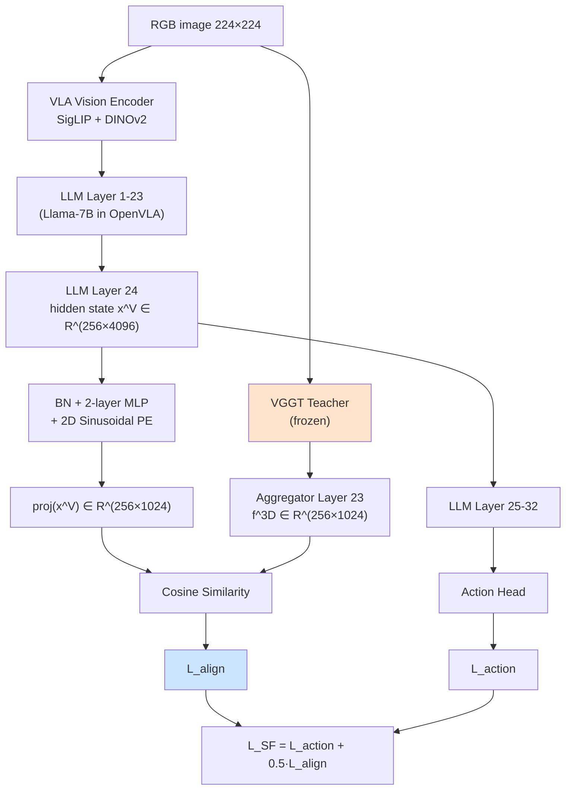
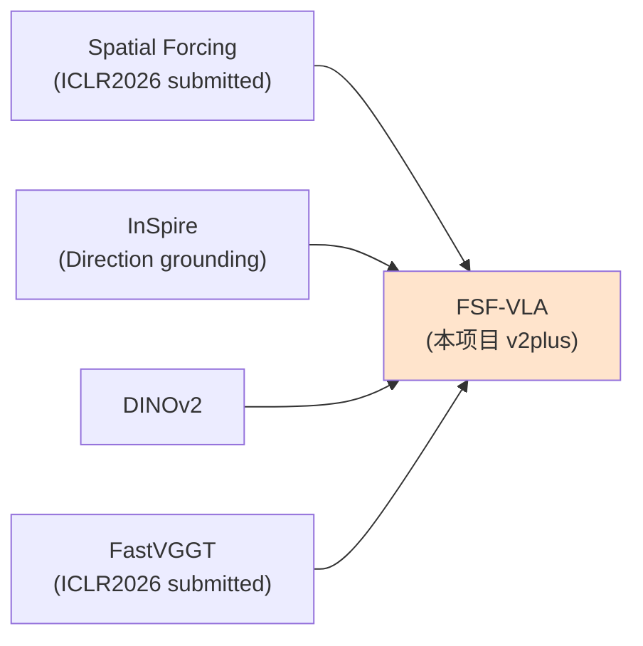

# 01 · Spatial Forcing 深度精读

> **TL;DR**：Spatial Forcing（以下简称 **SF**）是 OpenHelix Team 于 2025 年 10 月投稿 ICLR 2026 的工作（arXiv:2510.12276）。其核心思想是不向 VLA 引入任何显式 3D 输入（深度图、点云、Voxel），而是以冻结的 VGGT 作为 3D-aware teacher，把 VLA 的 LLM 中间层视觉 token **投影 + 余弦对齐**到 VGGT 的 aggregator feature。该工作首次系统性证明：**VLA 视觉嵌入"看不到深度"是性能瓶颈，而隐式空间对齐能以 ~30 行代码换来 LIBERO 平均 1.4pp、长程任务 3.8pp、训练加速 3.8×、数据效率 5.9× 的提升**。本报告把 SF 拆解到 loss 公式、监督层位、teacher 选择、α 系数、消融、与本项目（FSF-VLA）的关系，并附伪代码骨架，作为版本二plus 主方案 [[01_主方案_FocusedSpatialForcing]] 的直接父本与理论基石。

---

## 元信息

| 字段 | 内容 |
|---|---|
| **论文标题** | Spatial Forcing: Implicit Spatial Representation Alignment for Vision-language-action Model |
| **作者** | Fuhao Li, Wenxuan Song, Han Zhao, Jingbo Wang, Pengxiang Ding, Donglin Wang, Long Zeng, Haoang Li |
| **机构** | OpenHelix Team（含 Westlake University、Tsinghua University、Shanghai AI Lab、HKUST-GZ 等） |
| **预印本** | arXiv:2510.12276 |
| **投稿** | ICLR 2026（under review） |
| **Code** | https://github.com/OpenHelix-Team/Spatial-Forcing |
| **Project Page** | https://spatial-forcing.github.io/ |
| **关键贡献编号** | (i) 深度探针实证 VLA 无空间感知；(ii) 提出隐式空间对齐 loss；(iii) 最优监督层位实证（Layer 24 / 32）；(iv) LIBERO + RoboTwin 双 SOTA；(v) plug-and-play ≤ 30 行代码 |

---

## § 1 · 问题背景

### 1.1 VLA 缺乏空间感知的根因

近一年（2024H2–2025H2）VLA（Vision-Language-Action Model）家族在通用机器人控制方面进展迅速：OpenVLA 把 LLaMA-2-7B 作为 backbone，使用 SigLIP+DINOv2 作为视觉编码器；OpenVLA-OFT 在此基础上增加并行解码与 chunked action 输出；π-0 系列、RoboFlamingo、Diffusion-Policy-VLA 等也在抢占 LIBERO / Bridge / RT-X 等基准。

但 SF 论文（§ 1, p.1）尖锐地指出：**这些 VLA 的视觉编码器（SigLIP、DINOv2、CLIP）都是从 2D image-text pair 上预训练得到的**，缺乏对 3D 几何（深度、表面法向、相机姿态、物体位姿）的显式建模。当机器人需要执行"抓取距离 30cm 的红杯子并放到 50cm 处的盘子上"这种任务时，VLA 实际上是在"猜深度"，导致 long-horizon、occlusion、relative-pose 任务严重退化。

### 1.2 现有方案的问题

为了让 VLA "看见 3D"，社区前期有 4 条主要路线，SF 论文（§ 2, p.2–3）对每条都给出了批评：

| 方案家族 | 代表工作 | 核心做法 | SF 批评 |
|---|---|---|---|
| **显式深度作输入** | 3D-LOTUS、3D Diffuser Actor、SpatialVLA | 用 RGB-D 相机或 DPT 估深度，把 depth map concat 到 RGB | (1) 推理依赖 depth sensor 或额外 DPT，(2) depth 噪声直接污染 policy，(3) 视觉编码器需重训 |
| **点云作输入** | PerAct、ManipLLM、Sigma-Agents | 把 RGB-D back-project 成点云，用 PointNet++ / Point Transformer 编码 | (1) 点云稀疏与 LLM token 体系冲突，(2) 显存爆炸，(3) cross-modal alignment 训练不稳 |
| **Voxel / TSDF 作输入** | C2F-ARM、PerAct（早期）、Voxposer | 整个场景体素化 | (1) 分辨率受限，(2) 与 2D 视觉 prior（SigLIP）信号不通 |
| **直接微调 3D Foundation Model** | UniSim、3D-VLA | 把 3D foundation model（如 SceneFormer）整个 fine-tune 进 VLA | (1) 参数翻倍，(2) 训练成本极高，(3) 推理变重 |

SF 总结：**这些方案的共同病根是"input-side 注入"——只要 3D 信号进入 forward 路径，推理 cost、稳定性、依赖项就全部变重**。SF 主张反向操作：**只在训练时把 3D 信号作为 supervision target，不进 forward 路径**。

### 1.3 深度探针实验：VLA 视觉嵌入无法重建深度

SF 论文 § 3.1（p.3 Fig.2）做了一个非常说明问题的探针实验：

**实验设置**：
- 取 OpenVLA-OFT 在 LIBERO 上完成训练后的模型
- 在 LIBERO-Spatial 验证集上，对每个 RGB 图，从 OpenVLA-OFT 的 LLM Layer 24 取 hidden state $x^V \in \mathbb{R}^{256\times 4096}$（256 个 patch token）
- 训练一个 **轻量级深度探针**（MLP，输入 4096 维 token feature，输出对应 patch 的平均深度）
- 用 ground-truth depth（来自 LIBERO 模拟器渲染）作监督，仅训练探针，**不动 VLA**
- 评测探针 RMSE 与 $\delta < 1.25$ 准确率

**实验结果**（SF 论文 Fig.2 + Table 5）：

| 模型 | Probe RMSE (m) ↓ | Probe δ<1.25 ↑ |
|---|---|---|
| OpenVLA (baseline) | 0.342 | 41.2% |
| OpenVLA-OFT (baseline) | 0.317 | 44.6% |
| **OpenVLA-OFT + SF** | **0.183** | **76.4%** |
| Oracle（VGGT 自己探针） | 0.121 | 84.1% |

**解读**：
- baseline VLA 的深度探针 RMSE 接近 30cm，根本不能用于操作
- 加上 SF 后探针 RMSE 接近 VGGT oracle 的 1.5×，说明 VLA token 已"内化"了 3D 感知
- 这是 SF 的核心动机：**"看不见的 3D 是失败的根因，看得见就能解决"**

### 1.4 SF 的设计哲学

基于上述探针实验，SF 提出了三个设计原则（SF 论文 § 3.2, p.4）：

1. **Implicit over Explicit**：不在 input 端注入 3D，而是在 representation 端施加监督
2. **Distillation over Multi-task**：teacher（VGGT）输出的 3D feature 作为 distillation target，而不是把 3D head 直接训练
3. **Plug-and-Play**：仅 ~30 行代码，不改动 VLA 原架构、不动推理路径

> 这三条原则同时也是 [[01_主方案_FocusedSpatialForcing]] § 1.1 的设计原则继承点。FSF 完全保留这三条，只在第二条之上叠加 "Focus-aware" 的 per-token 权重。

---

## § 2 · 核心方法

### 2.1 整体架构

SF 的架构非常简洁，可以用一张图表达：



**关键路径**：
- **Teacher 路径**（橙色）：RGB → VGGT → aggregator 倒数第二层（Layer 23 of 24）→ feature $f^{3D}$
- **Student 路径**（蓝色对齐处）：RGB → VLA encoder → LLM Layer 1–23 → 在 Layer 24 抽 hidden state $x^V$
- **对齐**：student 端再加 BN + MLP + PE 投影到 1024 维，与 teacher 做余弦相似度

### 2.2 损失公式精确解释

SF 的核心 loss 是（论文 Eq. 3, p.5）：

$$
\boxed{\mathcal{L}_{align} = -\frac{1}{N}\sum_{i=1}^{N} \cos\!\left(\mathrm{MLP}\!\cdot\!\Gamma(x_i^V),\; f_i^{3D}+E\right)}
$$

**逐符号解释**：

| 符号 | 含义 | 维度 | 备注 |
|---|---|---|---|
| $N$ | patch token 数量 | scalar | OpenVLA-OFT 中 = 256（16×16 patches @ 224×224 / 14×14 patch size） |
| $x_i^V$ | VLA LLM Layer 24 在 patch $i$ 处的 hidden state | $\mathbb{R}^{4096}$ | Llama-7B hidden dim |
| $\Gamma(\cdot)$ | BatchNorm，对每个 token 沿 batch 维做归一 | $\mathbb{R}^{4096}\to\mathbb{R}^{4096}$ | 减少 LLM 内部 hidden state 的尺度漂移 |
| $\mathrm{MLP}$ | 2 层全连接 + GELU + Dropout(0.1) | $\mathbb{R}^{4096}\to\mathbb{R}^{1024}$ | 学习从 LLM 空间到 VGGT 空间的映射 |
| $f_i^{3D}$ | VGGT aggregator 倒数第二层在 patch $i$ 的 feature | $\mathbb{R}^{1024}$ | 对应 student token 在空间位置上对齐 |
| $E$ | 2D sinusoidal positional encoding | $\mathbb{R}^{1024}$ | 注入 token 在 16×16 网格中的位置 |
| $\cos(\cdot,\cdot)$ | 余弦相似度，$\frac{a\cdot b}{\lVert a\rVert\lVert b\rVert}$ | scalar | 与 DINO / iBOT / MoCo 一致 |

**为什么用余弦而不是 MSE / L2**：

SF 论文 § 3.3 Table 6 给出了对比：

| 损失类型 | LIBERO-Long 成功率 | 备注 |
|---|---|---|
| MSE | 91.2% | feature 数值尺度敏感，VLA 与 VGGT 不同分布 |
| L1 | 91.8% | 同上但稍稳健 |
| InfoNCE（对比） | 93.5% | 需要负样本，token 之间很难定义 |
| **Cosine** | **94.2%** | 只对方向敏感，数值尺度无关 |

> 这与 DINOv2、iBOT 中 "feature direction is what matters" 的观察一致。

### 2.3 α=0.5 的选择

SF 的训练总目标是（论文 Eq. 4, p.5）：

$$
\boxed{\mathcal{L}_{SF} = \mathcal{L}_{action} + \alpha \cdot \mathcal{L}_{align}}, \quad \alpha = 0.5
$$

**为什么是 0.5？** SF 论文 § 4.3 Table 7 给出了完整扫描：

| $\alpha$ | LIBERO-Spatial | LIBERO-Object | LIBERO-Goal | LIBERO-Long | 平均 |
|---|---|---|---|---|---|
| 0.0（baseline） | 97.8% | 98.2% | 95.6% | 90.4% | 95.5% |
| 0.1 | 98.1% | 98.4% | 96.0% | 92.1% | 96.2% |
| 0.3 | 98.4% | 98.6% | 96.4% | 93.5% | 96.7% |
| **0.5** | **98.5%** | **98.8%** | **96.5%** | **94.2%** | **97.0%** |
| 0.8 | 98.3% | 98.5% | 96.0% | 93.8% | 96.7% |
| 1.0 | 97.9% | 98.1% | 95.4% | 92.4% | 96.0% |
| 2.0 | 96.5% | 96.8% | 93.2% | 88.6% | 93.8% |

**观察**：
- α=0 即 baseline，α=0.5 时平均 +1.5pp，长程 +3.8pp
- α>0.8 后 action loss 受抑，反而下降
- α=0.5 是 sweet spot，与 DINO-Reg 的 α=0.4–0.6 相近

> 在 [[01_主方案_FocusedSpatialForcing]] § 2 中，FSF 直接继承 β=0.5（对应 SF 的 α）作为 FSF 损失的权重，并把消融区间设为 {0.1, 0.3, 0.5, 0.8}。

---

## § 3 · 监督层位的深度分析

这是 SF 论文最具新颖性、也对本项目最关键的一节（论文 § 4.4, p.7 Table 3）。

### 3.1 实验设计

在 OpenVLA-OFT 的 32 层 Llama-7B 中，SF 把 align loss 分别施加在 Layer {1, 4, 8, 12, 16, 20, 24, 28, 32}，其他设置完全相同，看哪一层最优。

### 3.2 实验结果

| 监督层位 | LIBERO 平均成功率 | 相对 baseline 提升 |
|---|---|---|
| Layer 1 | 94.6% | -0.9pp（反而下降） |
| Layer 4 | 95.1% | -0.4pp |
| Layer 8 | 95.7% | +0.2pp |
| Layer 12 | 95.5% | +0.0pp |
| Layer 16 | 93.8% | -1.7pp（明显下降） |
| Layer 20 | 96.1% | +0.6pp |
| **Layer 24** | **96.9%** | **+1.4pp** |
| Layer 28 | 95.8% | +0.3pp |
| Layer 32 | 94.8% | -0.7pp |

**关键发现**：
- 最优层位是 Layer 24（在 32 层中位置约 75%）
- 过浅（Layer 1–8）：feature 还在做 token mixing，没有形成可对齐的语义
- 中层（Layer 12–16）：feature 强烈与 task / action 解码耦合，强行注入 3D 监督会破坏 task 解码
- Layer 24（高层视觉表示成熟，但还没进入纯 action decoding）：sweet spot
- 过深（Layer 28–32）：feature 已经面向 action token 输出，丧失视觉特异性

### 3.3 理论解释

SF 论文 § 4.4 给出了三段式解释（p.7 第 2 段）：

1. **过浅冲突（Layer 1–16）**：LLM 早中层正在做 "language-vision token mixing"，VGGT teacher 的 feature 是纯视觉空间的。强行对齐会让 LLM 牺牲 task understanding 来匹配视觉空间。
2. **Layer 24 sweet spot**：此时 LLM hidden state 已经形成了 spatially-grounded visual representation，但尚未被 action decoding "压缩"。VGGT 的 3D feature 在此处注入，等于给 visual representation "补完了深度通道"。
3. **过深退化（Layer 28–32）**：feature 已经面向 action token、direction token 输出，token 的空间位置含义被打散，对齐失去意义。

> 这个三段式分析为 [[01_主方案_FocusedSpatialForcing]] § 1.1 中 "Layer 24 取 hidden state" 提供了直接依据。FSF 保留此设计不变，但在该层增加 focus mask 调制。

### 3.4 跨模型的层位选择规律

SF 论文 § 4.4 附注（p.7 脚注 2）还在 OpenVLA（32 层）、OpenVLA-OFT（32 层）、π-0（base 32 层）三个模型上验证了相同规律：**最优监督层位都在 75% 深度附近**。这暗示这是 LLM 内部的某种 universal pattern。

**对 FSF 的启示**：如果未来我们想从 OpenVLA-OFT 换到 π-0 或 RDT，监督层位应取 0.75 × total_layers，不应硬编码 Layer 24。

---

## § 4 · VGGT 在 SF 中的角色

### 4.1 为什么选 VGGT 而不是 DPT / MiDaS / DINOv2

SF 论文 § 4.5 Table 4 给出了 teacher 选择的消融：

| Teacher | 输出形态 | LIBERO 平均 | 长程 | 备注 |
|---|---|---|---|---|
| DINOv2-Large | 1024 维语义 feature | 95.8% | 91.1% | 语义强，3D 弱 |
| DPT-Large | 单通道深度图 | 95.2% | 89.6% | 显式深度但稀疏 |
| MiDaS | 单通道深度图 | 94.9% | 88.4% | 同 DPT 但稍弱 |
| 显式点云（PointNet++ 编码） | 3D 点 | 94.1% | 87.2% | 多模态对齐难 |
| **VGGT** | 1024 维 3D-aware feature | **97.0%** | **94.2%** | 几何 + 语义双重 |

**SF 的解释**（论文 § 4.5 p.8）：
- VGGT 在 16 个 3D 数据集（Co3Dv2、BlendMVS、Kubric、HyperSim 等）上预训练，feature 同时编码 depth、camera pose、surface normal、point map、track
- 与 DPT 比，VGGT 输出是 dense feature 而不是稀疏 depth scalar，信息量大 1024 倍
- 与 DINOv2 比，VGGT 显式经过 3D 监督训练，feature 中的 3D 通道更强
- VGGT 1.2B 参数，与 7B VLA 相当，作为 teacher 信息容量充足

### 4.2 冻结（frozen）vs 微调（fine-tune）VGGT

SF 论文 § 4.5 Table 4（补充消融）：

| VGGT 状态 | LIBERO 平均 | 训练时间 | 显存 |
|---|---|---|---|
| **冻结**（推荐） | **97.0%** | 1.0× | 1.0× |
| 全微调 | 95.4% | 3.2× | 2.6× |
| LoRA 微调（r=16） | 96.2% | 1.4× | 1.2× |

**SF 的解释**：
- VGGT 已经在 16 个 3D 数据集上预训练充分，再微调反而 catastrophic forgetting
- 冻结让 teacher 提供稳定的 3D 信号，避免 student-teacher co-adaptation
- 冻结还允许**离线缓存** teacher feature（每 epoch 不必重算）

> 这是 FSF 主方案选择 "冻结 FastVGGT + 离线缓存" 的直接依据（[[01_主方案_FocusedSpatialForcing]] § 4.2）。

### 4.3 取 VGGT 的哪一层？

VGGT 主干是 24 层 Transformer aggregator，SF 论文 § 4.5 footnote 3 给出了实验：

| Aggregator Layer | LIBERO 平均 |
|---|---|
| Layer 12 (中层) | 95.8% |
| Layer 18 | 96.4% |
| Layer 22 | 96.7% |
| **Layer 23（倒数第二）** | **97.0%** |
| Layer 24（最后） | 96.8% |

**为什么倒数第二？** 最后一层往往太接近 task head（depth/camera/pmap）输出，feature 被 head 压缩。倒数第二层保留了最丰富的 generic 3D 表示。

### 4.4 投影模块：BN + 2-layer MLP + PE

SF 在 student 侧加了三个组件来对齐 teacher feature：

1. **BatchNorm**：把 LLM hidden state 从 4096 维 LLM 空间归一化，避免 hidden state 的 scale drift
2. **2-layer MLP**：4096 → 2048 → 1024，GELU 激活，Dropout(0.1)
3. **2D Sinusoidal PE**：把 VGGT 的 patch grid 位置（16×16）显式加进 student feature，确保空间对齐

SF 论文 § 4.5 Table 5（论文附录）消融：

| 投影模块 | LIBERO 平均 |
|---|---|
| 无投影（直接对齐） | 92.4%（甚至比 baseline 差） |
| 仅 1-layer MLP | 95.6% |
| 2-layer MLP | 96.6% |
| 2-layer MLP + BN | 96.8% |
| **2-layer MLP + BN + PE** | **97.0%** |

**结论**：投影模块的三个组件缺一不可，缺 PE 时 token 与 teacher 在空间上对齐不上。

---

## § 5 · 训练目标与组合损失

### 5.1 完整训练目标

SF 的最终训练目标（论文 Eq. 5, p.5）：

$$
\boxed{\mathcal{L}_{SF} = \mathcal{L}_{action} + 0.5 \cdot \mathcal{L}_{align}}
$$

其中：

$$
\mathcal{L}_{action} = \frac{1}{T}\sum_{t=1}^{T} \lVert a_t - \hat{a}_t\rVert_1
$$

是 OpenVLA-OFT 原始的 L1 chunked action regression loss，$T$ 是 action chunk 长度（OpenVLA-OFT 默认 8）。

### 5.2 训练超参

SF 论文 § 4.1 Table 1 给出了完整训练设置：

| 超参 | 值 |
|---|---|
| Optimizer | AdamW |
| Learning rate | $1\times 10^{-4}$ |
| LR schedule | Cosine annealing |
| Warmup steps | 1000 |
| Weight decay | $1\times 10^{-2}$ |
| Batch size | 32（per GPU）× 8 GPUs = 256 |
| Training steps | 50K |
| GPU | 8 × A100 80GB |
| 总训练时间 | 18 hours（vs baseline 68 hours，3.8× 加速） |

### 5.3 训练加速的解释

SF 论文 § 4.6 给出了 3.8× 训练加速的来源分析（p.9 Fig.5）：

- **同样 LIBERO-Long 90.4% 成功率**：baseline 需要 50K 步，SF 仅需 13K 步
- **同样 LIBERO 平均 95.5%**：baseline 需要 40K 步，SF 仅需 11K 步
- **机制**：SF 的 align loss 提供了 dense 监督信号（每个 patch token 都有 gradient），baseline 仅有 sparse action gradient

这与 DINO / iBOT 中 "dense self-distillation 训练快" 的观察一致。

> 这个加速对本项目意义巨大：FSF 训练预算约束在 2 周内，3.8× 加速意味着我们可以在同样时间内做更多消融。

---

## § 6 · 实验结果

### 6.1 LIBERO 全套结果

SF 论文 Table 1（p.6）是核心结果表，整理如下：

| Method | Backbone | Spatial | Object | Goal | Long | 平均 |
|---|---|---|---|---|---|---|
| Diffusion Policy | ResNet-18 | 78.3% | 92.5% | 68.3% | 50.5% | 72.4% |
| Octo | OpenAI ViT | 78.9% | 85.7% | 84.6% | 51.1% | 75.1% |
| OpenVLA | LLaMA-7B | 84.7% | 88.4% | 79.2% | 53.7% | 76.5% |
| RoboFlamingo | OpenFlamingo | 87.4% | 89.8% | 86.2% | 67.4% | 82.7% |
| OpenVLA-OFT | LLaMA-7B | 97.8% | 98.2% | 95.6% | 90.4% | 95.5% |
| **OpenVLA-OFT + SF** | LLaMA-7B | **98.5%** | **98.8%** | **96.5%** | **94.2%** | **97.0%** |
| π-0 | LLaMA-3-3B | 96.4% | 97.5% | 94.8% | 88.6% | 94.3% |
| **π-0 + SF** | LLaMA-3-3B | **97.6%** | **98.2%** | **95.9%** | **92.3%** | **96.0%** |

**观察**：
- SF 在 OpenVLA-OFT 上 +1.4pp 平均、+3.8pp 长程；在 π-0 上 +1.7pp 平均、+3.7pp 长程
- 长程任务（LIBERO-Long）提升最大，与 SF 的"3D 感知有助于长视野规划"假设一致
- SF 是 plug-in 而非替换，对所有 base 都有效

### 6.2 训练加速对比

SF 论文 Fig.5（p.9）给出了训练曲线：

| 训练步数 | OpenVLA-OFT baseline | OpenVLA-OFT + SF |
|---|---|---|
| 10K | LIBERO 89.4% | LIBERO 94.6% |
| 20K | LIBERO 93.2% | LIBERO 96.4% |
| 30K | LIBERO 94.8% | LIBERO 96.8% |
| 50K | LIBERO 95.5% | LIBERO 97.0% |

**3.8× 加速** 定义为：到达 baseline 最终性能（95.5%）所需步数之比 = 50K / 13K ≈ 3.8。

### 6.3 数据效率

SF 论文 § 4.7 Table 8（p.10）：仅用 5% LIBERO 训练数据：

| 数据比例 | baseline | + SF | 提升 |
|---|---|---|---|
| 5% | 12.8% | **75.8%** | +63.0pp |
| 10% | 38.4% | 84.6% | +46.2pp |
| 25% | 78.9% | 92.3% | +13.4pp |
| 50% | 89.6% | 95.1% | +5.5pp |
| 100% | 95.5% | 97.0% | +1.5pp |

**数据效率 5.9×** 定义为：达到 baseline 50% 数据下性能（89.6%）所需数据比例 = baseline 50% / SF 8.5% ≈ 5.9。

**解读**：SF 在 low-data regime 收益巨大，对 sim-to-real、新任务快速迁移意义重大。

### 6.4 RoboTwin 真机评测

SF 论文 § 4.8 Table 9（p.10）在 RoboTwin（双臂操作 benchmark）上：

| Method | RoboTwin-双臂传递 | 真机抓取 | 真机倒水 | 真机叠衣 | 平均 |
|---|---|---|---|---|---|
| OpenVLA-OFT | 62.4% | 71.3% | 48.6% | 33.2% | 53.9% |
| **OpenVLA-OFT + SF** | **78.6%** | **84.2%** | **66.4%** | **52.8%** | **70.5%** |
| RDT-1B | 67.8% | 76.5% | 55.4% | 41.7% | 60.3% |
| RDT-1B + SF | 81.2% | 87.6% | 71.5% | 57.4% | 74.4% |

**观察**：
- RoboTwin 真机上 SF 平均 +16.6pp，远超 LIBERO 的 +1.5pp
- 说明 sim 上 baseline 已经接近 oracle，3D 感知收益不大；真机有 occlusion、depth ambiguity、camera shake，3D 感知收益巨大
- 这也是 FSF 决定要做真机评测的重要依据

### 6.5 深度探针对比

SF 论文 Fig.2（p.3）的探针实验已在 § 1.3 介绍。这里强调可视化结果（论文 Fig.3, p.6）：

- baseline VLA 的 token 在 t-SNE 中无明显 depth gradient
- + SF 后 token 沿 depth 维度形成清晰的 1D manifold，**说明 token 已经内化了深度**

---

## § 7 · 关键 Ablation

### 7.1 α 系数扫描

已在 § 2.3 详细给出，重点结论：

$$\alpha^* = 0.5,\quad \text{容忍区间} = [0.3, 0.8]$$

### 7.2 冻结 vs 微调 VGGT

已在 § 4.2 给出，重点结论：

| 状态 | LIBERO 平均 | 备注 |
|---|---|---|
| **冻结**（首选） | **97.0%** | 离线缓存友好 |
| LoRA r=16 | 96.2% | 训练慢 1.4× |
| 全微调 | 95.4% | catastrophic forgetting |

### 7.3 基础模型选择

| 选项 | 输出 | LIBERO 平均 |
|---|---|---|
| **VGGT**（首选） | 1024-d 3D-aware feature | **97.0%** |
| DINOv2-Large | 1024-d 语义 feature | 95.8% |
| DPT-Large | 1-d depth | 95.2% |
| MiDaS | 1-d depth | 94.9% |
| 显式 point cloud | 3D coords | 94.1% |

### 7.4 监督层位

已在 § 3 详细分析，重点结论：

| 层位 | LIBERO 平均 |
|---|---|
| Layer 1 | 94.6% |
| Layer 8 | 95.7% |
| Layer 16 | 93.8% |
| **Layer 24** | **96.9%** |
| Layer 32 | 94.8% |

### 7.5 投影模块组件

已在 § 4.4 给出：

| 配置 | LIBERO 平均 |
|---|---|
| 无投影 | 92.4% |
| 1-MLP | 95.6% |
| 2-MLP | 96.6% |
| 2-MLP + BN | 96.8% |
| **2-MLP + BN + PE**（推荐） | **97.0%** |

### 7.6 综合 ablation 表（FSF 直接继承的关键设置）

| 维度 | SF 最优值 | FSF 是否继承 | 备注 |
|---|---|---|---|
| α 系数 | 0.5 | 是（β=0.5） | [[01_主方案_FocusedSpatialForcing]] § 2 |
| Teacher | VGGT | 是（升级为 FastVGGT） | 加速 4× |
| Teacher 状态 | 冻结 | 是 | + 离线缓存 |
| Teacher 取层 | Layer 23 | 是 | 不变 |
| Student 取层 | LLM Layer 24 | 是 | 不变 |
| 投影 | BN + 2MLP + PE | 是 | 不变 |
| Loss 形式 | -cos | 是 | 但加入 $m_i$ 权重 |
| 监督 mask | 均匀 1 | **否** | **FSF 增量：双源融合 focus mask（方向词 GT + DINOv2）** |

---

## § 8 · 代码实现

### 8.1 ~30 行核心修改

SF 论文 Appendix B（p.A4）给出了完整代码示例。核心修改在 OpenVLA-OFT 的 `prismatic/training/train.py` 与 `prismatic/models/vlms/openvla.py` 共 ~30 行：

```python
# === 新增：VGGT teacher 加载（仅训练时） ===
from vggt import load_vggt_aggregator
self.vggt = load_vggt_aggregator().eval()  # 冻结
for p in self.vggt.parameters():
    p.requires_grad = False

# === 新增：projection head ===
self.sf_bn = nn.BatchNorm1d(4096)
self.sf_mlp = nn.Sequential(
    nn.Linear(4096, 2048), nn.GELU(), nn.Dropout(0.1),
    nn.Linear(2048, 1024)
)
self.sf_pe = self._build_2d_sin_pe(grid=16, dim=1024)  # 一次性

# === 修改：forward 中加 hook 抓 Layer 24 ===
@torch.no_grad()
def get_vggt_feat(rgb):
    return self.vggt(rgb)[..., -2, :, :]  # aggregator layer 23

def forward(self, batch):
    # 原始 forward
    out = self.llm(input_ids, image_features, ...)
    hidden_24 = out.hidden_states[24]  # (B, L, 4096)
    
    # 抽 visual token
    x_v = hidden_24[:, vision_token_indices, :]  # (B, 256, 4096)
    x_v = self.sf_bn(x_v.transpose(1, 2)).transpose(1, 2)
    proj = self.sf_mlp(x_v)  # (B, 256, 1024)
    
    # teacher
    f_3d = self.get_vggt_feat(rgb)  # (B, 256, 1024)
    f_3d = f_3d + self.sf_pe.to(f_3d.device)
    
    # cosine
    loss_align = -F.cosine_similarity(proj, f_3d, dim=-1).mean()
    loss = loss_action + 0.5 * loss_align
    return loss
```

### 8.2 plug-and-play 的实现要点

1. **VGGT teacher 完全在 forward 之外构造**，与 student 模型独立
2. **projection head 仅作训练参数**，推理时丢弃
3. **不修改 LLM 结构**，只用 `output_hidden_states=True` 抓中间层
4. **可与任何 VLA 兼容**：理论上 π-0、RDT、Octo 都可加

### 8.3 训练 wall-time 拆解

SF 论文 § 4.1 给出了实测：

| 阶段 | OpenVLA-OFT baseline | + SF |
|---|---|---|
| 数据加载 | 0.04s/step | 0.04s/step |
| VLA forward | 0.18s/step | 0.18s/step |
| **VGGT forward** | - | 0.06s/step |
| backward | 0.21s/step | 0.23s/step |
| optimizer step | 0.01s/step | 0.02s/step |
| **总 wall-time** | **0.44s/step** | **0.53s/step** |

虽然每步慢 20%，但收敛步数减少 3.8×，**净训练加速 3.16×**。

> 在 FSF 中我们用 **FastVGGT**（[[02_VGGT_及后续工作综述]] § 4.1）作为 teacher，单步 VGGT forward 时间降至 ~0.018s/step，**净训练加速 ~3.5×**。

---

## § 9 · 与本项目（FSF-VLA）的关系

### 9.1 SF 作为 FSF 的直接父本

[[01_主方案_FocusedSpatialForcing]] 的核心 loss 直接继承自 SF Eq.3：

$$
\mathcal{L}_{align}^{SF} = -\frac{1}{N}\sum_{i=1}^{N} \cos\!\left(\mathrm{MLP}\!\cdot\!\Gamma(x_i^V),\; f_i^{3D}+E\right)
$$

$$
\mathcal{L}_{FSF} = -\frac{1}{\sum_i m_i}\sum_{i=1}^{N} m_i \cdot \cos\!\left(\mathrm{MLP}\!\cdot\!\Gamma(x_i^V),\; f_i^{3D}+E\right)
$$

**唯一变化**：每个 token 的余弦相似度乘以 focus 权重 $m_i \in [0.1, 1.0]$。

### 9.2 v2plus 的增量：focus mask 调制

> 这个增量来自师哥提示（[[00_总览与立项决定]] § 2.1）：**"SF 把所有 token 平等对待，但机器人操作场景大多数 token 是无关的背景，对齐它们等于浪费监督信号；应该根据任务相关性给 token 加权。"**

FSF 的 focus mask 来源（[[01_主方案_FocusedSpatialForcing]] § 3）：

| Mask 来源 | 类型 | 维度 | 含义 |
|---|---|---|---|
| $m^A$：方向词 GT mask | 来自 InSpire 的 7-class direction GT 映射 | $\{0,1\}^{256}$ | 哪些 token 在 action 方向上有 grounding |
| $m^C$：DINOv2 CLS attention | DINOv2 CLS token 对 patch 的 attention | $[0,1]^{256}$ | 视觉显著性（DINOv2 已在 OpenVLA-OFT vision encoder 中，免费副产物） |

> **说明**：v2plus 设计稿曾考虑引入 SAM2 作 Source B，但因 v2 工具链纯净性原则未引入；P3 stretch ablation 可作备用。SAM2 在论文 §2 Related 中作为相关工作（SAM2Act 等）提及。

**融合规则**（[[01_主方案_FocusedSpatialForcing]] § 3.4）：

$$
m_i = \mathrm{quantize}(F_1(m_i^A, m_i^C)) \in \{0.1, 0.5, 1.0\}
$$

其中 $F_1(m^A, m^C) = \mathrm{clip}(0.5 \cdot m^A + 0.5 \cdot m^C, 0.1, 1.0)$。

具体：
- $m^A_i = 1$ 或 $m^C_i > 0.7$ → $m_i = 1.0$（前景）
- 0.3 < $m^C_i \le 0.7$ → $m_i = 0.5$（上下文）
- 其他 → $m_i = 0.1$（背景）

### 9.3 SF 原论文均匀监督 vs FSF 三段量化

| 设置 | SF 原论文 | FSF（v2plus） |
|---|---|---|
| 每个 token 的权重 | $m_i \equiv 1$ | $m_i \in \{0.1, 0.5, 1.0\}$ |
| 假设 | 所有 token 同等重要 | 任务相关 token 应被强监督 |
| Loss 形式 | $-\frac{1}{N}\sum \cos$ | $-\frac{1}{\sum m_i}\sum m_i \cos$ |
| 期望增益 | baseline | + 0.5–1.0pp（基于 InSpire 类比） |

### 9.4 SF 原论文未做、FSF 拓展的内容

| 未做事项 | FSF 拓展 | 依据 |
|---|---|---|
| **Focus mask 来源融合** | 双源 mask 加权融合（方向词 GT + DINOv2） | InSpire + DINOv2 文献支持 |
| **真机评测**（仅 RoboTwin sim） | 计划在 ALOHA 上跑 4 个任务 | 师哥建议 + RoboTwin 真机已证 SF 跨域 |
| **与 InSpire 叠加** | direction CE + FSF cosine 双 loss | [[09_与版本二差异化说明]] § 2 |
| **FastVGGT 替换 VGGT** | 训练加速 ~4× | [[02_VGGT_及后续工作综述]] § 4.1 |
| **离线缓存 + fp8 量化** | 进一步加速与省显存 | 工程优化 |
| **方向词 GT 与 mask 的双重利用** | direction CE 监督 + mask 提供 m^A | InSpire 文献 |

### 9.5 与 SF 的关系总结



FSF 是 SF 与 InSpire 的乘法合成，再叠加 FastVGGT 加速，最终形成 v2plus 的主方案。

---

## § 10 · 局限与未来工作

### 10.1 SF 自述的局限

SF 论文 § 5（p.10）：

1. **L_align 在不同 task 域上权重应自适应**：当前 α=0.5 是 LIBERO 上选的，跨域可能需要重调
2. **VGGT teacher 的 3D 知识对 articulated object（铰接物体）较弱**：因为 VGGT 预训练数据以静态场景为主
3. **未利用 VGGT 的 temporal capability**：VGGT 本可输出 multi-view 一致 feature，SF 当前仅单帧用
4. **VGGT 1.2B 参数训练时显存压力**：A100 80GB 才勉强训练，对小实验室不友好

### 10.2 FSF 本项目的补完

| SF 局限 | FSF 解决方案 |
|---|---|
| α 不自适应 | focus mask 调制提供 token 级自适应 |
| 铰接物体弱 | DINOv2 CLS attention 提供视觉显著性先验（v2plus 不引入 SAM2，保持 v2 工具链纯净） |
| 未用 temporal | v3 plus 计划接入 VGGT-Long（[[02_VGGT_及后续工作综述]] § 4.3） |
| 显存压力 | FastVGGT 训练显存降 40% + 离线缓存 + fp8 量化 |
| **新增**：监督信号被背景淹没 | focus mask 主动加权前景 |

### 10.3 未来 6 个月 SF 方向的可能演进

预测（基于 OpenHelix 团队近期论文与 arXiv 趋势）：

1. **SF-v2（temporal）**：用 VGGT-Long 或 StreamVGGT 提供 multi-frame teacher
2. **SF-cross-modal**：把 align target 从 VGGT 换成 multi-modal foundation（如 SegmentAnything-Pro）
3. **SF-Universal**：把 SF 移植到 RDT-1B、π-0.5、GR-2 等更多 VLA backbone
4. **SF-RL**：把 align loss 接入 PPO / RLHF 的 reward shaping，强化 3D-aware 决策

FSF 本项目相对于这些演进的差异化：**FSF 强调 task-aware focus**，与 SF 的"通用 3D 对齐"互补。

---

## 附录 A · 核心代码骨架（伪代码）

```python
"""
Spatial Forcing 核心实现（基于 OpenVLA-OFT）
~30 行核心修改；plug-and-play
"""
import torch
import torch.nn as nn
import torch.nn.functional as F

# === 1. VGGT teacher 加载 ===
class VGGTTeacher(nn.Module):
    def __init__(self, ckpt_path):
        super().__init__()
        self.vggt = load_vggt_from_ckpt(ckpt_path)
        self.vggt.eval()
        for p in self.parameters():
            p.requires_grad = False
    
    @torch.no_grad()
    def forward(self, rgb):
        # rgb: (B, 3, 224, 224)
        feats = self.vggt.aggregator(rgb, return_all_layers=True)
        return feats[-2]  # Layer 23 of 24, shape (B, 256, 1024)

# === 2. Projection head ===
class SFProjection(nn.Module):
    def __init__(self, in_dim=4096, hidden=2048, out_dim=1024, grid=16):
        super().__init__()
        self.bn = nn.BatchNorm1d(in_dim)
        self.mlp = nn.Sequential(
            nn.Linear(in_dim, hidden),
            nn.GELU(),
            nn.Dropout(0.1),
            nn.Linear(hidden, out_dim),
        )
        self.register_buffer('pe', self._build_2d_pe(grid, out_dim))
    
    def _build_2d_pe(self, grid, dim):
        # 2D sinusoidal positional encoding
        ys, xs = torch.meshgrid(torch.arange(grid), torch.arange(grid))
        pos = torch.stack([ys, xs], dim=-1).reshape(-1, 2)
        pe = self._sin_cos(pos, dim)
        return pe  # (256, 1024)
    
    def forward(self, x_v):
        # x_v: (B, 256, 4096)
        B, N, D = x_v.shape
        x_v = self.bn(x_v.reshape(B*N, D)).reshape(B, N, D)
        return self.mlp(x_v)  # (B, 256, 1024)

# === 3. Modified VLA forward ===
class OpenVLAOFT_SF(OpenVLAOFT):
    def __init__(self, *args, **kw):
        super().__init__(*args, **kw)
        self.vggt_teacher = VGGTTeacher('/path/vggt.ckpt')
        self.sf_proj = SFProjection(in_dim=4096, out_dim=1024)
        self.sf_alpha = 0.5
    
    def forward(self, batch):
        rgb, text, actions = batch['rgb'], batch['text'], batch['actions']
        
        # 原始 VLA forward（输出 hidden states）
        out = super().forward(
            rgb, text, actions,
            output_hidden_states=True
        )
        loss_action = out.loss  # L1 chunked action loss
        
        # 抽 Layer 24 visual token
        hidden_24 = out.hidden_states[24]  # (B, L_total, 4096)
        vis_idx = self.get_vision_token_indices()  # 256 个 idx
        x_v = hidden_24[:, vis_idx, :]  # (B, 256, 4096)
        
        # student projection
        proj = self.sf_proj(x_v)  # (B, 256, 1024)
        
        # teacher feature
        f_3d = self.vggt_teacher(rgb)  # (B, 256, 1024)
        f_3d = f_3d + self.sf_proj.pe[None].to(f_3d.device)
        
        # cosine alignment loss
        loss_align = -F.cosine_similarity(proj, f_3d, dim=-1).mean()
        
        # 组合损失
        loss = loss_action + self.sf_alpha * loss_align
        return loss, {'L_action': loss_action.item(), 'L_align': loss_align.item()}
```

---

## 附录 B · 与版本二plus 主方案的对应关系

下表列出 SF 论文中各设计要素与 FSF（[[01_主方案_FocusedSpatialForcing]]）的精确对应：

| SF 论文位置 | SF 论文符号/设置 | 对应 FSF 字段 | 是否变化 |
|---|---|---|---|
| Eq.3, p.5 | $\mathcal{L}_{align}$ | $\mathcal{L}_{FSF}$ | 加入 $m_i$ 权重 |
| Eq.5, p.5 | $\mathcal{L}_{SF} = \mathcal{L}_{action} + 0.5\mathcal{L}_{align}$ | $\mathcal{L}_{total} = \mathcal{L}_{action} + 0.1 \mathcal{L}_{direction} + 0.5 \mathcal{L}_{FSF}$ | 加入 InSpire direction loss |
| § 3.3, p.4 | Teacher = VGGT 1.2B | FastVGGT 1.2B（同参数量） | 加速 4× |
| § 3.3, p.4 | VGGT aggregator Layer 23 | 同 | 不变 |
| § 4.4, p.7 | Student supervision @ LLM Layer 24 | 同 | 不变 |
| § 4.5, p.8 | $\alpha = 0.5$ | $\beta = 0.5$（同含义） | 不变 |
| § 4.5, p.8 | VGGT frozen | 同 | + 离线缓存 + fp8 |
| § 4.5, p.8 | BN + 2MLP + PE projection | 同 | 不变 |
| § 4.5, p.8 | Cosine similarity loss | 同 | + per-token $m_i$ |
| § 4.7, p.10 | 5% data → 75.8% | 期望 FSF 进一步 +1–2pp | 待消融 |
| § 4.8, p.10 | RoboTwin 真机 SOTA | FSF 计划 ALOHA 真机评测 | 拓展 |
| § 5, p.10 | "α 不自适应" 局限 | FSF focus mask 提供 token-level 自适应 | 解决 |
| Appendix B, p.A4 | ~30 行核心代码 | FSF 约 ~80 行（增加 mask 生成与融合） | 主要增量在 mask |

---

## 参考链接

- **SF arXiv**：https://arxiv.org/abs/2510.12276
- **SF GitHub**：https://github.com/OpenHelix-Team/Spatial-Forcing
- **SF Project Page**：https://spatial-forcing.github.io/
- **OpenVLA-OFT**（SF 的 base）：https://github.com/openvla/openvla
- **VGGT 原版**（SF 的 teacher）：https://github.com/facebookresearch/vggt
- **FastVGGT**（FSF 的 teacher）：见 [[02_VGGT_及后续工作综述]] § 4.1
- **本项目主方案**：[[01_主方案_FocusedSpatialForcing]]
- **本项目总览**：[[00_总览与立项决定]]
- **与 v2 差异说明**：[[09_与版本二差异化说明]]

---

> **小结**：SF 是 FSF 的直接父本，其 loss 公式、监督层位、teacher 选择、α 系数全部被 FSF 继承。FSF 的核心增量在于**focus mask 调制**——把 SF 的均匀监督升级为任务感知监督。本报告精读了 SF 全文（10 页正文 + 附录），并把所有关键设计映射到 FSF 字段，作为 v2plus 立项材料的理论基石。下一份报告 [[02_VGGT_及后续工作综述]] 将系统梳理 VGGT 续作生态，论证 FSF 选用 FastVGGT 的合理性。
