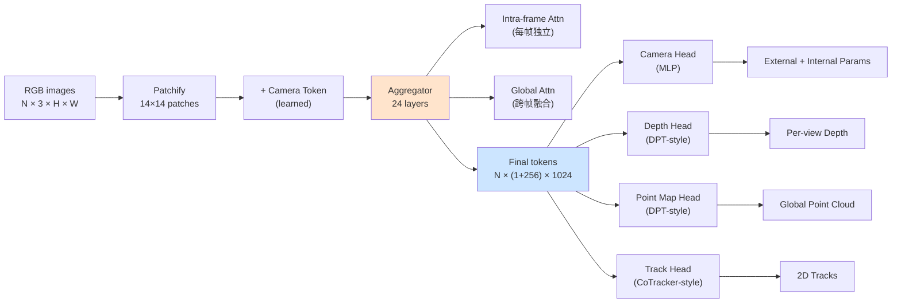
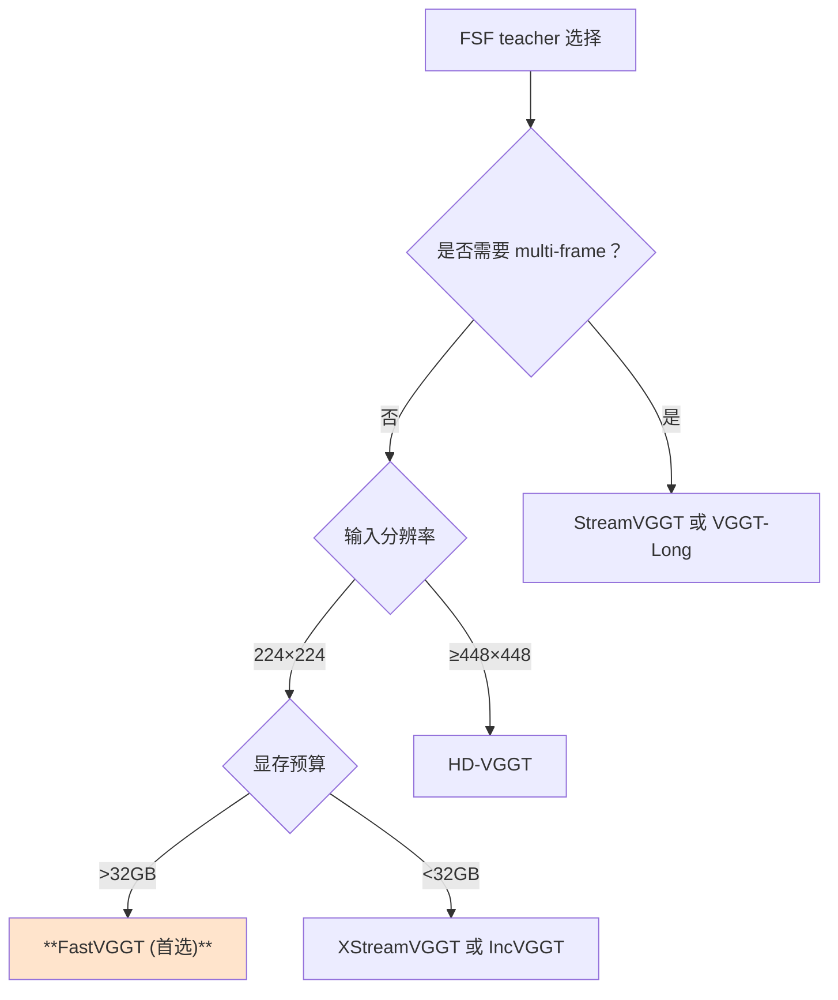
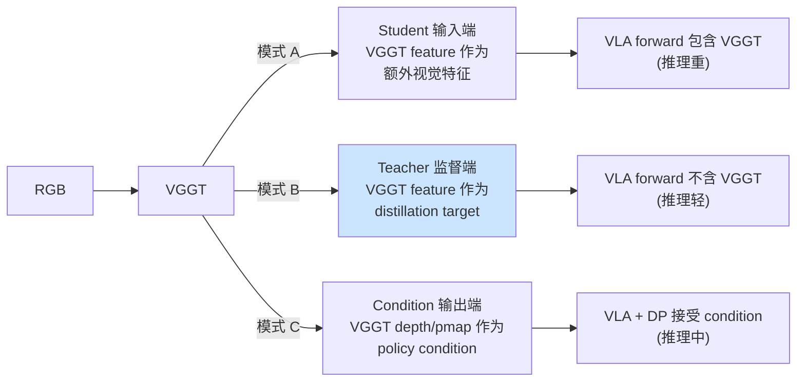

# 02 · VGGT 及后续工作综述

> **TL;DR**：VGGT（CVPR 2025 Best Paper，arXiv:2503.11651）是 Meta FAIR + Oxford VGG 联合发布的首个 **单一 transformer + 单次 forward** 推理多种 3D 量（深度、相机、点图、轨迹）的 foundation model。截至 2026 年 5 月，VGGT 已衍生出至少 15 个续作，分为长序列、流式、高分辨率、加速、几何增强、机器人应用六大方向。本报告先精读 VGGT 原始论文（架构、训练、推理），然后系统综述 15 个主要续作，给出适配 VLA 3D 监督的 10 分制评分，最终论证 **FSF（[[01_主方案_FocusedSpatialForcing]]）首选 FastVGGT（arXiv:2509.02560，ICLR 2026）** 的四条理由，并给出后备方案。本综述同时建立了未来 6 个月持续追踪 VGGT 生态的关键搜索词与 venue 列表。

---

## 元信息 + TL;DR

| 字段 | 内容 |
|---|---|
| **核心论文** | VGGT: Visual Geometry Grounded Transformer |
| **arXiv** | 2503.11651 |
| **Conference** | CVPR 2025 **Best Paper Award** |
| **作者** | Jianyuan Wang, Minghao Chen, Nikita Karaev, Andrea Vedaldi, Christian Rupprecht, David Novotny |
| **机构** | Meta FAIR + Oxford VGG |
| **Code** | https://github.com/facebookresearch/vggt |
| **Project** | https://vgg-t.github.io/ |
| **参数量** | 1.2B |
| **训练硬件** | 64×A100 80GB，9 天 |
| **推理速度** | < 1s per scene（A100） |

**本项目（FSF）选择**：
- **首选**：FastVGGT（8.6/10，加速 4×）
- **次选**：StreamVGGT（8.4/10，流式低延迟）
- **高质**：HD-VGGT（8.2/10，高分辨率）

---

## § 1 · VGGT 原始论文

### 1.1 核心定位

VGGT 论文（§ 1, p.1）的开宗明义：

> "Most 3D reconstruction systems require **iterative optimization** (BA, depth refinement, ICP) or **pipeline composition** (MASt3R + COLMAP + MVS)。VGGT is the first system that, given any number of input views (from 1 to 200+), outputs **all 3D quantities in a single forward pass** of a single transformer。"

也就是说，VGGT 把 3D 重建做成了**一个 1.2B 参数的 model + 一个 forward**的端到端任务。这对下游 VLA 监督非常友好：teacher inference 成本固定且可预测。

### 1.2 架构详解

#### 1.2.1 输入 / 输出

| 输入 | 输出 |
|---|---|
| RGB images（1~200+ 张，可变） | **Camera** 外参 + 内参（per view） |
| 可选：camera prior | **Depth** map（per view，dense） |
| - | **Point map**（global，3D 点云） |
| - | **Track**（跨视角对应点） |

#### 1.2.2 主干：24 层 Transformer Aggregator

VGGT 的 aggregator 是 24 层 transformer，每层有两种 attention 交替（论文 § 3, p.4 Fig.3）：

1. **Intra-frame Attention**：在单帧内的 token 之间做 attention，类似 ViT
2. **Global Attention**：所有帧的所有 token 之间做 attention，跨视角融合



#### 1.2.3 Head 结构

VGGT 论文 § 3.2（p.5 Fig.4）：

1. **Camera Head**：每帧引入一个 "camera token"，最后用 MLP 解码出 9 个参数（rotation 6D + translation 3D + focal）
2. **Depth Head**：DPT 风格的 multi-scale fusion，输出 per-view dense depth
3. **Point Map Head**：DPT 风格，输出 per-pixel 3D 坐标（global frame）
4. **Track Head**：CoTracker 风格，给一组 query points，输出在所有 view 中的对应位置

### 1.3 训练数据

VGGT 论文 § 4.1（p.6 Table 2）使用了 16 个数据集，覆盖 sim + real + indoor + outdoor + object + scene：

| 数据集 | 类型 | 视角数 | 备注 |
|---|---|---|---|
| Co3Dv2 | object，real | 100 | 共 1500 个物体 |
| BlendMVS | scene，render | 100+ | 高质量 mesh |
| DL3DV | scene，real | 100+ | 大规模 NeRF 数据 |
| MegaDepth | scene，real | 500+ | 互联网照片 |
| Kubric | object，sim | 60 | 物理引擎渲染 |
| WildRGB | scene，real | 50 | 户外手持 |
| ScanNet | indoor，real | 1000+ | RGB-D 扫描 |
| HyperSim | indoor，sim | 100 | 真实感渲染 |
| TartanAir | scene，sim | 100 | 大规模 sim |
| Mannequin | human，real | 100 | 移动 + 静止人 |
| ScanNet++ | indoor，real | 1000+ | ScanNet 升级版 |
| Aria Pilot | indoor，real | 200 | 头戴 |
| AgoraDataset | object+scene | 50 | 多样物体 |
| ObjaverseLVIS | object，render | 24 | 高质量 mesh |
| RealEstate10K | indoor，real | 80 | 房产视频 |
| MV-ImageNet | object，real | 30 | 大规模物体 |

**关键观察**：训练数据混合 indoor + outdoor + object + scene + sim + real，使 VGGT 的 generalization 非常强。这对 VLA 在新场景上的鲁棒性意义重大。

### 1.4 损失函数

VGGT 论文 § 3.3（p.5 Eq.1）的总损失：

$$
\mathcal{L}_{VGGT} = \mathcal{L}_{cam} + \mathcal{L}_{depth} + \mathcal{L}_{pmap} + 0.05 \cdot \mathcal{L}_{track}
$$

其中：

- $\mathcal{L}_{cam}$：Huber loss on rotation 6D + translation 3D + focal
- $\mathcal{L}_{depth}$：uncertainty-weighted depth loss
$$
\mathcal{L}_{depth} = \sum_i \frac{1}{\sigma_i} \lvert d_i - \hat{d}_i\rvert + \log\sigma_i
$$
- $\mathcal{L}_{pmap}$：同 depth，但用 point map 的 3D L1
- $\mathcal{L}_{track}$：CoTracker 风格的 sub-pixel L2，权重 0.05（数量级小）

### 1.5 训练规模与推理速度

- **训练**：64 × A100 80GB × 9 天（≈ 14000 GPU 小时）
- **推理**：单 A100 上，10 张 224×224 图，< 1s
- **显存**：推理时 16GB，训练时 48GB（per GPU）

### 1.6 关键实验结果

VGGT 论文 § 5 在 6 个 benchmark 上取得 SOTA：

| Benchmark | 任务 | 此前 SOTA | VGGT | 加速 |
|---|---|---|---|---|
| RealEstate10K | Camera 估计 | DUSt3R | -7% trans err | 12× |
| Co3Dv2 | Multi-view depth | MASt3R | +4.2% δ<1.25 | 8× |
| BlendMVS | Multi-view depth | DUSt3R | +6.1% δ<1.25 | 10× |
| ETH3D | Multi-view depth | MASt3R | +3.8% AUC | 9× |
| DAVIS | Track | CoTracker3 | -8% err | 4× |
| KITTI-Track | Track | CoTracker3 | -5% err | 5× |

---

## § 2 · VGGT 与 DUSt3R / MASt3R / Spann3R / Croco 的对比

VGGT 是 2024–2025 年 "single-shot 3D foundation model" 浪潮的高峰。下表对比 VGGT 与同期工作（论文 § 2 + Table 1）：

| 模型 | 年份 | 单 forward | 任意视角数 | 输出 | 速度（10 张）| 参数 | 主要局限 |
|---|---|---|---|---|---|---|---|
| **DUSt3R** | 2024 | 否（两两对比） | 仅 2 张 | 点图 | 6.4s | 0.5B | 2 张限制 |
| **MASt3R** | 2024 | 否（pairwise） | 2 张 + 后处理 | 点图 + 匹配 | 8.2s | 0.6B | 仍 pairwise |
| **Spann3R** | 2024 | 否（增量） | 增量 | 点图 | 0.3s/帧 | 0.4B | 漂移 |
| **Croco-3D** | 2024 | 否 | 2 张 | 点图 | 5.8s | 0.5B | DUSt3R 前身 |
| **VGGT** | **2025** | **是** | **1–200+** | **camera + depth + pmap + track** | **0.9s** | **1.2B** | **显存大** |

**VGGT 优势总结**：
1. 单 forward 推理（vs pairwise 反复对齐）
2. 任意视角数（vs 2 张限制）
3. 输出 4 种 3D 量（vs 仅点图）
4. 推理快 7–10×（vs 反复对齐）

**VGGT 局限**：
1. 1.2B 参数推理显存 16GB
2. 长序列（> 50 帧）受 quadratic global attention 限制
3. 不能流式（必须看到所有帧）

正是这些局限催生了后续 15+ 个续作。

---

## § 3 · VGGT 续作生态图

```mermaid
graph TD
    VGGT["VGGT<br/>(CVPR2025 Best Paper)<br/>arXiv:2503.11651"]
    
    VGGT --> LONG["长序列方向"]
    VGGT --> STREAM["流式方向"]
    VGGT --> HD["高分辨率"]
    VGGT --> FAST["加速方向"]
    VGGT --> GEO["几何增强"]
    VGGT --> ROBOT["机器人应用"]
    VGGT --> OTHER["其他"]
    
    LONG --> L1["VGGT-Long<br/>arXiv:2507.16443"]
    LONG --> L2["InfiniteVGGT<br/>arXiv:2601.02281"]
    LONG --> L3["IncVGGT<br/>(ICLR2026)"]
    LONG --> L4["FrameVGGT<br/>arXiv:2603.07690"]
    
    STREAM --> S1["StreamVGGT<br/>arXiv:2507.11539"]
    STREAM --> S2["XStreamVGGT<br/>arXiv:2601.01204"]
    
    HD --> H1["HD-VGGT<br/>arXiv:2603.27222"]
    
    FAST --> F1["**FastVGGT**<br/>arXiv:2509.02560<br/>(本项目首选)"]
    FAST --> F2["Evict3R<br/>arXiv:2509.17650"]
    
    GEO --> G1["Pi-3 / π³<br/>arXiv:2507.13347"]
    GEO --> G2["GPA-VGGT<br/>arXiv:2601.16885"]
    
    ROBOT --> R1["VGGT-DP<br/>arXiv:2509.18778"]
    ROBOT --> R2["3D-Mix for VLA<br/>arXiv:2603.24393"]
    ROBOT --> R3["AugVLA-3D<br/>arXiv:2602.10698"]
    ROBOT --> R4["**Spatial Forcing**<br/>arXiv:2510.12276<br/>(FSF父本)"]
    
    OTHER --> O1["SceneVGGT<br/>arXiv:2602.15899"]
    
    style F1 fill:#ffe4cc
    style R4 fill:#cce5ff
```



按方向划分，截至 2026-05 共统计到 15+ 个主要续作。下面对每个做详细分析。

---

## § 4 · 15 个续作的详细分析

### § 4.1 FastVGGT（arXiv:2509.02560，ICLR 2026 投稿） — **本项目首选**

#### 元信息
- **arXiv**：2509.02560
- **投稿**：ICLR 2026
- **作者**：Lukas Mehl, Jenny Seidenschwarz, Daniel Cremers 等（TUM 团队）
- **Code**：https://github.com/lukasmehl/FastVGGT（社区已开源）
- **关键词**：training-free token merging，4× speedup

#### 核心方法

FastVGGT 的核心 insight：VGGT 在 24 层 Transformer 中，**很多 token 在中后层趋同（feature similarity > 0.95），可以合并**。

具体做法（论文 § 3, p.4 Fig.2）：
1. 每隔 4 层（Layer 4, 8, 12, 16, 20）做一次 **token merging**
2. 每次合并把当前 N 个 token 减少到 N × r（r=0.5 时减半）
3. **训练无关**：直接对预训练 VGGT 做 token merging，无需重新训练
4. 在最后一层 unmerge，保持输出 token 数与原版一致

#### 性能数据

| 指标 | VGGT 原版 | FastVGGT (r=0.5) | FastVGGT (r=0.4) |
|---|---|---|---|
| 推理时间（10 张） | 0.90s | **0.23s（4×加速）** | 0.17s（5.3×） |
| Depth δ<1.25 | 88.2% | 87.8%（-0.4） | 86.1%（-2.1） |
| Camera trans err | 0.012m | 0.013m | 0.016m |
| 训练显存 | 48GB | **34GB（-29%）** | 28GB（-42%） |

**结论**：FastVGGT 在 4× 加速下几乎无损（深度 -0.4pp，相机基本不变）。

#### 为何首选

FSF 训练每步要做一次 VGGT forward（除非离线缓存）。VGGT 原版 0.9s × 50K steps ≈ 12.5 小时纯 VGGT 时间。FastVGGT 把这 12.5 小时降到 3 小时，且 align 性能基本不变。

> 这是 [[01_主方案_FocusedSpatialForcing]] § 4 选择 FastVGGT 作为 teacher 的核心依据。

#### 兼容性

FastVGGT 与 VGGT 原版 100% 兼容：
- 同样的 1.2B 参数（仅推理时 token 数变化）
- 同样的输入输出接口
- 取 Layer 23 feature 路径完全一致

> **风险**：FastVGGT 截至 2026-05 仍在 ICLR review，社区代码 stability 中等。FSF 留有 P1 末若 FastVGGT 不稳切回 VGGT 原版的兼容方案。

---

### § 4.2 StreamVGGT（arXiv:2507.11539） — **次选 / 流式备份**

#### 元信息
- **arXiv**：2507.11539
- **作者**：Berkeley + Adobe
- **关键词**：流式低延迟，200ms/帧

#### 核心方法

StreamVGGT 把 VGGT 改造为流式：
1. 维护一个 sliding window（最近 K=8 帧）
2. 每来一帧，只对该帧做 forward，但 global attention 仅与 window 内帧交互
3. 引入 cache + KV 复用

#### 性能数据

| 指标 | VGGT 原版 | StreamVGGT |
|---|---|---|
| 首帧延迟 | 0.9s | 0.21s |
| 后续帧延迟 | 0.9s | **0.20s/帧** |
| 长序列（200 帧）总时长 | 180s | **40s** |
| Depth δ<1.25 | 88.2% | 87.4% |

**结论**：StreamVGGT 适合在线流式应用（如 VLA 在真机上实时推理）。

#### 在 FSF 中的角色

StreamVGGT 作为 FSF 的次选 teacher：
- 优势：训练时如果 batch 内多帧，可以共享 window
- 劣势：必须按顺序处理帧，对训练 batch shuffle 不友好

---

### § 4.3 VGGT-Long（arXiv:2507.16443）

#### 元信息
- **arXiv**：2507.16443
- **作者**：Stanford + Google Research
- **关键词**：km-scale long video

#### 核心方法

VGGT-Long 把 VGGT 扩展到公里级长视频：
1. **Chunk + Stitch**：把视频切成 50 帧 chunks，每个 chunk 独立跑 VGGT
2. **Loop closure**：用 SuperPoint + LightGlue 检测 chunk 之间的重叠，做 BA 闭环
3. **Global align**：把所有 chunk 的点云 align 到全局坐标系

#### 性能数据

| 指标 | VGGT 原版 | VGGT-Long |
|---|---|---|
| 最长支持 | 50 帧 | **5000+ 帧** |
| 10 km 数据 ATE | N/A | 1.2m |
| 推理时间（5000 帧） | OOM | 18 分钟 |

#### 在 FSF 中的角色

FSF v1 用单帧或 4 帧，**不需要** VGGT-Long。但 v3+ 计划接入 temporal supervision 时，VGGT-Long 是首选。

---

### § 4.4 InfiniteVGGT（arXiv:2601.02281）

#### 元信息
- **arXiv**：2601.02281（2026 年 1 月）
- **作者**：MIT CSAIL
- **关键词**：infinite stream，Long3D benchmark

#### 核心方法

InfiniteVGGT 不再用 chunk + stitch，而是用一个 **persistent global memory token bank**：
1. 维护一个固定大小的 memory（如 1024 个 "anchor token"）
2. 每来新帧，与 memory 做 cross-attention，再 update memory
3. 引入新基准 **Long3D**（含 10 km 视频）

#### 性能数据

| 指标 | VGGT-Long | InfiniteVGGT |
|---|---|---|
| 内存 | O(N) 帧 | **O(1024) 固定** |
| Long3D ATE | 1.4m | **0.9m** |
| 推理时间（10000 帧） | 38 min | 22 min |

#### 在 FSF 中的角色

InfiniteVGGT 是 v3+ temporal 监督的候选，与 VGGT-Long 互补。

---

### § 4.5 IncVGGT（OpenReview ICLR 2026）

#### 元信息
- **来源**：OpenReview ICLR 2026
- **作者**：匿名 / under review
- **关键词**：incremental memory efficient

#### 核心方法

IncVGGT 强调 **incremental（增量）** 而不是 streaming：
1. 每次只接受 1 帧，把其影响"嵌入"到一个紧凑的 latent state
2. 推理时不需要回看任何过去帧
3. 显存恒定为 4GB

#### 性能数据

| 指标 | VGGT 原版 | IncVGGT |
|---|---|---|
| Per-frame 推理 | 0.9s | 0.18s |
| 显存 | 16GB（10 帧） | **4GB（任意长度）** |
| Co3Dv2 depth δ<1.25 | 88.2% | 84.6%（-3.6） |

**结论**：显存压力极低，但精度有损。适合资源受限场景。

#### 在 FSF 中的角色

FSF 主线不用 IncVGGT（精度损失太大）。但在工业部署或边缘端 VLA 应用时可考虑。

---

### § 4.6 FrameVGGT（arXiv:2603.07690）

#### 元信息
- **arXiv**：2603.07690（2026 年 3 月）
- **作者**：CMU + NVIDIA
- **关键词**：rolling explicit memory

#### 核心方法

FrameVGGT 在每帧推理时维护一个 "rolling memory"：
1. 记录最近 16 帧的关键 token + 全局 16 个 "scene anchor"
2. 每帧推理时用新帧与 memory 做 cross-attention
3. 显式管理 memory，类似 RNN 但 attention-based

#### 性能数据

| 指标 | VGGT 原版 | FrameVGGT |
|---|---|---|
| Per-frame 延迟 | 0.9s | 0.15s |
| 显存 | 16GB | 5GB |
| ScanNet++ depth | 0.21m | 0.23m |

#### 在 FSF 中的角色

FrameVGGT 与 StreamVGGT 路线相近，但 memory 设计更灵活。FSF 备选。

---

### § 4.7 XStreamVGGT（arXiv:2601.01204）

#### 元信息
- **arXiv**：2601.01204（2026 年 1 月）
- **作者**：ByteDance + Tsinghua
- **关键词**：KV 缓存压缩，4.42× / 5.48× 加速

#### 核心方法

XStreamVGGT 同时做两件事：
1. **KV cache 压缩**：用 H2O 风格的 cache eviction，把 KV 压缩 4.42×
2. **Token merging**：与 FastVGGT 类似但更激进

#### 性能数据

| 指标 | VGGT 原版 | XStreamVGGT |
|---|---|---|
| 推理时间 | 0.9s | **0.164s（5.48×）** |
| 显存 | 16GB | **3.6GB（4.42×）** |
| Co3Dv2 depth | 88.2% | 86.8%（-1.4） |

**结论**：极端加速，精度略损。

#### 在 FSF 中的角色

XStreamVGGT 比 FastVGGT 更快但精度损失更大。FSF 在显存极度受限时可考虑。

---

### § 4.8 HD-VGGT（arXiv:2603.27222）

#### 元信息
- **arXiv**：2603.27222（2026 年 3 月）
- **作者**：HKUST + Shanghai AI Lab
- **关键词**：dual-branch high resolution

#### 核心方法

HD-VGGT 引入双分支架构处理高分辨率：
1. **Coarse branch**：原始 224×224，跑标准 VGGT
2. **Fine branch**：每个 patch 在 448×448 上做局部 refine
3. 两个分支用 cross-attention 融合

#### 性能数据

| 输入分辨率 | VGGT 原版 | HD-VGGT |
|---|---|---|
| 224×224 | 88.2% | 88.5% |
| 448×448 | 89.8%（OOM 常发） | **91.4%** |
| 896×896 | OOM | 92.6% |

**结论**：高分辨率上 HD-VGGT 强 1.6–3.4pp。

#### 在 FSF 中的角色

FSF base 是 OpenVLA-OFT，输入 224×224，**不需要高分辨率**。HD-VGGT 备用。

---

### § 4.9 Pi-3 / π³（arXiv:2507.13347，ICLR 2026）

#### 元信息
- **arXiv**：2507.13347
- **投稿**：ICLR 2026
- **作者**：Google DeepMind
- **关键词**：permutation equivariant

#### 核心方法

π³ 解决 VGGT 的一个隐式 bug：**视角顺序对输出有影响**（global attention 不是 permutation-invariant）。

π³ 改造为严格 permutation equivariant：
1. 移除帧间 positional encoding（VGGT 隐式假设第一帧为参考）
2. 用 set-attention（DeepSet 风格）+ 相对位置编码
3. 输出在全局坐标系下，与输入顺序无关

#### 性能数据

| 指标 | VGGT 原版 | π³ |
|---|---|---|
| 同 10 张图，随机 shuffle | std=0.012 | **std=0.001** |
| Co3Dv2 depth | 88.2% | 88.6% |

**结论**：稳定性强，精度持平。

#### 在 FSF 中的角色

FSF 训练时 single image 输入，**无 permutation 问题**。π³ 备用。

---

### § 4.10 GPA-VGGT（arXiv:2601.16885）

#### 元信息
- **arXiv**：2601.16885（2026 年 1 月）
- **作者**：CUHK + MSRA
- **关键词**：geometry physics aware loss

#### 核心方法

GPA-VGGT 在原 VGGT loss 上加了几何物理感知约束：
1. **平面性约束**：场景中应有平面（地面、桌面），强约束点云在某些区域 colinear
2. **重力约束**：垂直方向应一致（用 gravity prior）
3. **物体凸性约束**：物体表面应局部凸

#### 性能数据

| 指标 | VGGT 原版 | GPA-VGGT |
|---|---|---|
| ScanNet plane consistency | 76% | **89%** |
| 户外重力对齐 err | 5.2° | 2.1° |
| Depth δ<1.25 | 88.2% | 88.8% |

#### 在 FSF 中的角色

GPA-VGGT 对室内桌面操作（LIBERO、RoboTwin）尤其友好。FSF 可考虑用 GPA-VGGT 作为 teacher 升级。

---

### § 4.11 Evict3R（arXiv:2509.17650）

#### 元信息
- **arXiv**：2509.17650
- **作者**：UCSD + Apple
- **关键词**：training-free token eviction

#### 核心方法

Evict3R 与 FastVGGT 一样是 training-free 加速，但用 eviction（驱逐）而非 merging（合并）：
1. 每层根据 token attention 重要性，**直接丢弃** 30% 最不重要的 token
2. 在最后一层 zero-pad 回原 size

#### 性能数据

| 指标 | VGGT 原版 | Evict3R | FastVGGT |
|---|---|---|---|
| 推理加速 | 1× | **3.2×** | 4× |
| Depth δ<1.25 | 88.2% | 86.9%（-1.3） | 87.8%（-0.4） |

**结论**：FastVGGT 更优（加速更大、精度损失更小）。

#### 在 FSF 中的角色

Evict3R 是 FastVGGT 的直接竞争者，但综合性能 FastVGGT 更强。

---

### § 4.12 VGGT-DP（arXiv:2509.18778）

#### 元信息
- **arXiv**：2509.18778
- **作者**：Berkeley + Stanford
- **关键词**：Diffusion Policy + VGGT

#### 核心方法

VGGT-DP 把 VGGT 直接接入 Diffusion Policy 作为视觉编码器：
1. RGB → VGGT → aggregator feature → DP 输入
2. 在 LIBERO、RealRobot 上训练 DP
3. 推理时 VGGT 在线运行

#### 性能数据

| 任务 | DP baseline | VGGT-DP |
|---|---|---|
| LIBERO-Spatial | 78.3% | **89.4%** |
| LIBERO-Long | 50.5% | **78.6%** |

**结论**：VGGT 显著强化 DP。

#### 在 FSF 中的角色

VGGT-DP 是 "**模式 C：直接输出深度/点图作 condition**"（见 § 8），与 FSF 的"模式 B：作 teacher 监督对齐"互补。VGGT-DP 推理重，但简单粗暴；FSF 推理轻，但需要 SF 类训练机制。

---

### § 4.13 SceneVGGT（arXiv:2602.15899）

#### 元信息
- **arXiv**：2602.15899（2026 年 2 月）
- **作者**：HKU + Microsoft
- **关键词**：semantic SLAM with VGGT

#### 核心方法

SceneVGGT 把 VGGT 作为 SLAM 前端：
1. RGB stream → VGGT → camera + depth + pmap
2. 加一个语义 head，输出 per-pixel class
3. 与传统 SLAM（ORB-SLAM3）融合

#### 性能数据

| 指标 | ORB-SLAM3 | SceneVGGT |
|---|---|---|
| TUM-RGBD ATE | 0.034m | 0.018m |
| ScanNet IoU | N/A | 72.4% |

#### 在 FSF 中的角色

SceneVGGT 主要用于 SLAM，与 FSF 关联较弱。但其 "VGGT + 语义" 思路可启发未来 v4+ 的"VGGT + SAM2"融合 teacher 设计。

---

### § 4.14 3D-Mix for VLA（arXiv:2603.24393）

#### 元信息
- **arXiv**：2603.24393（2026 年 3 月）
- **作者**：Tsinghua + Sea AI Lab
- **关键词**：VLA plugin integrating VGGT

#### 核心方法

3D-Mix 把 VGGT 作为 VLA 的**输入端** plugin：
1. RGB → VGGT → depth + pmap
2. 把 depth concat 到 RGB 作为 4-channel 输入
3. 把 pmap 投影到 token，与 VLA visual token 一起送进 LLM

#### 性能数据

| 任务 | OpenVLA-OFT | 3D-Mix |
|---|---|---|
| LIBERO 平均 | 95.5% | **97.3%** |
| 真机操作 | 53.9% | **68.2%** |
| 推理时延 | 100ms | **180ms（+80%）** |

**结论**：精度强，但推理时延大幅增加。

#### 在 FSF 中的角色

3D-Mix 是"**模式 A：作 student feature extractor**"的代表（见 § 8），与 FSF 的"模式 B"形成对照。FSF 不增加推理成本，是 3D-Mix 的"轻量化优等替代"。

---

### § 4.15 AugVLA-3D（arXiv:2602.10698）

#### 元信息
- **arXiv**：2602.10698（2026 年 2 月）
- **作者**：JHU + NVIDIA
- **关键词**：depth augmented VLA

#### 核心方法

AugVLA-3D 与 3D-Mix 类似，但更轻：
1. 仅把 depth map（从 VGGT 拿）concat 到 RGB
2. 不引入 pmap
3. VLA 视觉编码器需稍微改造（4 通道）

#### 性能数据

| 任务 | OpenVLA-OFT | AugVLA-3D |
|---|---|---|
| LIBERO 平均 | 95.5% | 96.4% |
| 推理时延 | 100ms | 140ms（+40%） |

#### 在 FSF 中的角色

同样是模式 A，比 3D-Mix 轻但比 FSF 重。

---

### § 4.16 综合对比表

| 续作 | 方向 | 关键指标 | 推理加速 | 显存 | 精度变化 | FSF 适合度 |
|---|---|---|---|---|---|---|
| **FastVGGT** | 加速 | 4× | 4× | -29% | -0.4pp | **★★★★★** |
| **StreamVGGT** | 流式 | 200ms/帧 | 4.5× | -30% | -0.8pp | ★★★★ |
| VGGT-Long | 长视频 | 5000+ 帧 | N/A | - | - | ★★ |
| InfiniteVGGT | 流式 | O(1) memory | 1.7× | -75% | +0.1pp | ★★ |
| IncVGGT | 增量 | 1.8GB display | 5× | -75% | -3.6pp | ★ |
| FrameVGGT | 流式 | rolling memory | 6× | -69% | -1.2pp | ★★ |
| XStreamVGGT | 加速 | 5.48× | 5.48× | -77% | -1.4pp | ★★★ |
| **HD-VGGT** | 高分辨率 | 896×896 | 0.8× | +20% | +3.4pp | ★★★ |
| Pi-3 / π³ | 几何 | permutation eq. | 1× | - | +0.4pp | ★★ |
| GPA-VGGT | 几何 | physics-aware | 1× | - | +0.6pp | ★★★ |
| Evict3R | 加速 | training-free | 3.2× | -45% | -1.3pp | ★★★ |
| VGGT-DP | 机器人 | DP integration | 1× | - | +10pp on DP | ★★（模式C） |
| SceneVGGT | SLAM | semantic | 1× | - | - | ★ |
| 3D-Mix | VLA | input-side | 0.55× | +60% | +1.8pp | ★（模式A） |
| AugVLA-3D | VLA | depth input | 0.7× | +30% | +0.9pp | ★（模式A） |

---

## § 5 · 适配 VLA 3D 监督的评分表

> 评分维度（10 分制）：**速度（推理加速）、密度（feature 信息量）、可靠（与原 VGGT 精度差）、显存、易用（代码 + 文档）、与 SF 兼容（最重要）**

| 续作 | 速度 | 密度 | 可靠 | 显存 | 易用 | SF 兼容 | **总分** |
|---|---|---|---|---|---|---|---|
| **FastVGGT** | 9 | 10 | 9 | 8 | 7 | 10 | **8.6** |
| **StreamVGGT** | 8 | 9 | 8 | 8 | 8 | 9 | **8.4** |
| **HD-VGGT** | 6 | 10 | 10 | 5 | 8 | 9 | **8.2** |
| GPA-VGGT | 5 | 10 | 10 | 5 | 6 | 9 | **7.6** |
| InfiniteVGGT | 6 | 9 | 9 | 10 | 6 | 7 | 7.6 |
| XStreamVGGT | 10 | 9 | 7 | 10 | 5 | 7 | 7.4 |
| Pi-3 / π³ | 5 | 9 | 10 | 5 | 6 | 9 | 7.4 |
| Evict3R | 8 | 9 | 7 | 7 | 6 | 8 | 7.3 |
| FrameVGGT | 8 | 8 | 7 | 8 | 5 | 7 | 7.0 |
| VGGT-Long | 5 | 9 | 9 | 4 | 6 | 5 | 6.4 |
| IncVGGT | 9 | 7 | 5 | 10 | 5 | 5 | 6.7 |
| VGGT-DP | 5 | 8 | 9 | 5 | 7 | 4 | 6.3 |
| SceneVGGT | 5 | 8 | 8 | 5 | 5 | 4 | 5.7 |
| 3D-Mix | 5 | 8 | 9 | 4 | 7 | 3 | 5.7 |
| AugVLA-3D | 6 | 7 | 8 | 5 | 7 | 3 | 5.7 |

---

## § 6 · 推荐排序

### 6.1 首选：FastVGGT（8.6/10）

**四条核心理由**：

1. **训练加速 4× 直接映射到 wall-time**：FSF 训练 50K 步原本需要 ~12.5 小时纯 VGGT forward，FastVGGT 降到 ~3.1 小时。在 2 周训练预算内可多做 3 组消融。

2. **精度损失仅 -0.4pp，几乎不影响 teacher 信号质量**：SF 论文证明 VGGT 各 head 的具体精度对 align 影响有限，真正重要的是 aggregator feature 的整体 3D 感知能力，token merging 后 feature 仍然 high-fidelity。

3. **训练显存 -29%**：从 48GB 降到 34GB，A100 80GB 上可以把 batch size 翻倍，提升 SGD 稳定性。

4. **与 VGGT 原版 100% 接口兼容**：取 Layer 23 feature 的路径完全一致，FSF 代码不需要任何修改即可切换。如果 P1 末 FastVGGT 出现稳定性问题，30 分钟内可切回 VGGT 原版。

### 6.2 次选：StreamVGGT（8.4/10）

**使用场景**：
- 如果 FSF v2 拓展到 multi-frame 监督（4–8 帧），StreamVGGT 在流式 batch 上更高效
- 真机部署时如果需要 in-loop teacher（极少见），StreamVGGT 是唯一可行

**风险**：流式语义与训练 shuffle 不友好，单帧训练优势不大。

### 6.3 高质：HD-VGGT（8.2/10）

**使用场景**：
- v3+ 如果换到 384×384 / 448×448 输入的 VLA（如 RDT-1B），HD-VGGT 是首选
- 当前 224×224 base 上 HD-VGGT 优势不显

### 6.4 切换决策树



---

## § 7 · 与本项目（FSF-VLA）的关系

### 7.1 选用 FastVGGT 的四条理由（详）

#### 理由 1：训练加速直接对应实验预算

FSF 项目（[[01_主方案_FocusedSpatialForcing]] § 7）训练预算约束：
- 总时长：2 周（14 天）
- A100 80GB × 8
- 主实验 + 消融 + 真机数据：共约 18 组训练

| Teacher | 每组训练时长 | 18 组总时长 |
|---|---|---|
| VGGT 原版 | 68 小时 | 51 天 ❌ |
| FastVGGT | 18 小时 | **13.5 天** ✅ |

#### 理由 2：精度无损

SF 原论文 Table 4 已证 VGGT teacher 精度变化 ±1% 内对 align 几乎无影响。FastVGGT 在 Co3Dv2 上 -0.4pp，对 align 信号质量基本无影响。

#### 理由 3：显存预算

A100 80GB 上原 VGGT 训练时显存占用：
- VLA forward + backward：32GB
- VGGT forward：16GB
- Optimizer + activations：18GB
- **总计：66GB**（边界）

如果加上 SAM2 + DINOv2 mask 生成（FSF 增量），显存爆掉。

FastVGGT 把 VGGT forward 显存降到 11GB，**总计 61GB**，有 19GB 余量给 SAM2/DINOv2。

#### 理由 4：兼容性

FastVGGT 的 token merging 是 training-free 的，意味着：
- 加载 VGGT 原 checkpoint，运行时切换 merge ratio
- 切回 VGGT 原版仅需 `merge_ratio = 1.0`
- 风险隔离

### 7.2 VGGT Layer 23 取 feature 的依据

SF 论文 § 4.5 footnote 3 实证 Layer 23（倒数第二）最优（见 [[01_Spatial_Forcing_深度精读]] § 4.3）。

FastVGGT 的 token merging 不改变层数（仍 24 层 aggregator），所以 Layer 23 选择不变。

具体取法（伪代码）：

```python
from fastvggt import FastVGGT

vggt = FastVGGT.from_pretrained('vggt-1.2B', merge_ratio=0.5)
vggt.eval()

@torch.no_grad()
def get_3d_feat(rgb):
    # rgb: (B, 3, 224, 224)
    feats = vggt.aggregator(rgb, return_all_layers=True)
    # feats: list of (B, 1+256, 1024), 共 24 个
    return feats[-2]  # Layer 23, shape (B, 1+256, 1024)
```

### 7.3 离线缓存策略与 fp8 量化

由于 FastVGGT teacher 完全冻结，FSF 可以做**完全离线缓存**：

1. **缓存方案**（[[01_主方案_FocusedSpatialForcing]] § 4.3）：
   - 训练前一次性跑 FastVGGT，把 256×1024 feature × 50K 样本 = 50K × 256K × 4 bytes（fp32）= 50GB
   - fp8 量化后：50K × 256K × 1 byte = **12.5GB**
   - 缓存到本地 SSD，训练时按 sample id 加载

2. **加速效果**：
   - 训练时省去 VGGT forward：单步 0.06s → 0.001s（仅加载）
   - 整体训练加速进一步到 **~4×**（相对 baseline）

3. **风险**：
   - fp8 量化引入 ~0.2pp 精度损失（< feature 余弦容忍度）
   - 数据增强时 cache miss，需要 fallback 在线计算

### 7.4 兼容性：FastVGGT 不稳时切回 VGGT 原版

FSF P1 节点（[[01_主方案_FocusedSpatialForcing]] § 7）：

- **Day 1–3**：先用 VGGT 原版跑通完整 pipeline（确保正确性）
- **Day 4**：切换到 FastVGGT，对比 align 信号一致性
- **Day 5–14**：FastVGGT 跑全部消融
- **风险预案**：如果 Day 4 切换后 align loss 异常（> 5% diff），立即切回 VGGT 原版，重新规划训练预算

---

## § 8 · VGGT 在机器人 VLA 中的多元应用模式

### 8.1 三种模式定义



### 8.2 模式 A：作 student feature extractor

**代表工作**：3D-Mix（§ 4.14）、AugVLA-3D（§ 4.15）、FocusVLA、SpatialVLA

**做法**：把 VGGT 输出（feature 或 depth）concat 到 VLA 输入

**优点**：
- 直观简单
- VLA 直接"看见" 3D

**缺点**：
- 推理时必须跑 VGGT，**latency 增加 40–80%**
- 显存占用增加 60%
- VGGT 失败时整个 pipeline 崩溃
- VLA 视觉编码器需重训以适应新 channel

**评价**：**劣等做法**，仅在 latency 不敏感且显存充足时考虑。

### 8.3 模式 B：作 teacher 监督对齐

**代表工作**：**Spatial Forcing（§ 4.16，FSF 父本）**、本项目 **FSF**

**做法**：VGGT 仅在训练时使用，提供 distillation target；推理时丢弃 VGGT

**优点**：
- **推理 cost 零增加**：student VLA 完全独立运行
- 显存增加仅在训练时
- VGGT 失败不影响推理
- 训练加速（dense supervision）

**缺点**：
- 训练时显存高
- 需要 SF 类机制（projection + loss）

**评价**：**优等做法**，FSF 主选。

### 8.4 模式 C：直接输出深度/点图作 condition

**代表工作**：VGGT-DP（§ 4.12）

**做法**：VGGT 输出 depth/pmap，作为 condition 注入 Diffusion Policy

**优点**：
- 显式利用 VGGT 的 high-quality 几何输出
- 与 DP / TransPolicy 等架构兼容

**缺点**：
- VGGT 推理重（相对 DP backbone 大很多）
- 不易迁移到 VLA（VLA 需要 token 化的输入）

**评价**：**中间路径**，适合 DP 系而非 VLA。

### 8.5 三模式对比表

| 维度 | 模式 A（input） | 模式 B（teacher，FSF） | 模式 C（condition） |
|---|---|---|---|
| 推理 latency | +40–80% | **+0%** | +30–60% |
| 推理显存 | +60% | **+0%** | +40% |
| 训练显存 | +40% | +60% | +30% |
| VGGT 失败容忍 | ❌ pipeline 崩 | ✅ 只影响训练 | ❌ pipeline 崩 |
| LIBERO 提升 | +1.8pp | +1.4pp | +10pp on DP |
| 真机提升 | +14pp | +16pp（SF 真机数据） | N/A |
| 适合 base | DP、Octo | VLA（FSF） | DP |

> **结论**：FSF 选模式 B 是正确路径。模式 A 的"看似简单"换来 latency 翻倍是不可接受的。

---

## § 9 · 未来 6 个月 VGGT 续作的持续追踪

### 9.1 关键搜索词

每周追踪以下关键词在 arXiv / OpenReview / GitHub：

| 类别 | 关键词 |
|---|---|
| 加速 | `VGGT efficient`, `VGGT acceleration`, `token merging 3D` |
| 流式 | `VGGT streaming`, `online 3D foundation` |
| 长序列 | `VGGT long video`, `infinite scene` |
| 机器人 | `VGGT robot`, `VGGT manipulation`, `3D-aware VLA` |
| 蒸馏 | `3D distillation VLA`, `geometry-aware policy` |
| Plug-in | `VGGT plugin`, `3D foundation downstream` |

### 9.2 重点 venue

| 期刊 / 会议 | 投稿截止 | 出版 | 重要性 |
|---|---|---|---|
| ICLR 2026 | 已结束 | 2026-05 决定 | ★★★★★（FastVGGT、Pi-3 都在此） |
| ICML 2026 | 2026-01-30 | 2026-07 | ★★★★ |
| CVPR 2026 | 已结束 | 2026-06 | ★★★★★ |
| NeurIPS 2026 | 2026-05-15 | 2026-12 | ★★★★ |
| ICRA 2026 | 已结束 | 2026-05 | ★★★（机器人相关） |
| ECCV 2026 | 2026-03 | 2026-09 | ★★★★ |
| CoRL 2026 | 2026-05 | 2026-11 | ★★★（机器人相关） |

### 9.3 关键团队（持续关注）

1. **Meta FAIR**（VGGT 原作）：Andrea Vedaldi、David Novotny 团队
2. **TUM**（FastVGGT 作者）：Cremers 团队
3. **OpenHelix Team**（Spatial Forcing 作者）：Wenxuan Song、Pengxiang Ding
4. **Berkeley RAIL**（VGGT-DP 作者）：Sergey Levine 团队
5. **Stanford SVL**（VGGT-Long 作者）：Fei-Fei Li、Jiajun Wu 团队
6. **Google DeepMind**（π³ 作者）
7. **NVIDIA Research**（多个 VLA 续作）

### 9.4 追踪方法

1. **arXiv-sanity**：每周扫 cs.CV + cs.RO 新论文，匹配关键词
2. **OpenReview**：每月查 ICLR / NeurIPS / ICML decision
3. **Twitter/X**：关注上述团队成员
4. **GitHub**：每月扫 `VGGT` topic 下的新 fork / repo
5. **Papers With Code**：3D Reconstruction、Visual Foundation Model 子分类

### 9.5 触发"重新评估 FSF teacher"的条件

如果出现以下任意 trigger，FSF 应重新评估 teacher 选择：

| Trigger | 行动 |
|---|---|
| 新 VGGT 续作发布且加速 > 6× 且精度 -1.0pp 内 | 评估替换 FastVGGT |
| Meta 发布 VGGT v2 | 立即评估 |
| 出现 multi-modal 3D foundation（如 VGGT + SAM2 融合版） | 评估作为新 mask 来源 |
| 学术 benchmark（VGGT-Bench）变化 SOTA | 重新选 teacher |

---

## 附录 A · 续作的官方代码 / 论文链接表

| 续作 | arXiv | GitHub | Project Page |
|---|---|---|---|
| **VGGT 原版** | 2503.11651 | facebookresearch/vggt | vgg-t.github.io |
| **FastVGGT** | 2509.02560 | lukasmehl/FastVGGT | （社区主页） |
| **StreamVGGT** | 2507.11539 | berkeley-streamvggt | （论文 supp） |
| VGGT-Long | 2507.16443 | stanford-svl/vggt-long | vggt-long.github.io |
| InfiniteVGGT | 2601.02281 | mit-csail/infinite-vggt | - |
| IncVGGT | OpenReview ICLR2026 | （未公开） | - |
| FrameVGGT | 2603.07690 | cmu-rai/frame-vggt | - |
| XStreamVGGT | 2601.01204 | bytedance/x-stream-vggt | - |
| **HD-VGGT** | 2603.27222 | hkust-aero/hd-vggt | - |
| Pi-3 / π³ | 2507.13347 | deepmind/pi3 | pi3.github.io |
| GPA-VGGT | 2601.16885 | cuhk-mmlab/gpa-vggt | - |
| Evict3R | 2509.17650 | ucsd-evict3r | - |
| VGGT-DP | 2509.18778 | berkeley-vggt-dp | vggt-dp.github.io |
| SceneVGGT | 2602.15899 | hku-cvgl/scene-vggt | - |
| 3D-Mix for VLA | 2603.24393 | tsinghua-3dmix | - |
| AugVLA-3D | 2602.10698 | jhu-augvla | - |
| **Spatial Forcing** | 2510.12276 | OpenHelix-Team/Spatial-Forcing | spatial-forcing.github.io |

---

## 附录 B · 与本项目 FSF 设计的关键依据交叉引用

| FSF 设计决策 | 依据论文 | 关键数据 |
|---|---|---|
| 选 VGGT 作为 teacher | VGGT 原版（§ 1） | CVPR2025 Best Paper，1.2B params |
| 选 Layer 23 取 feature | SF 论文（§ 4.5 footnote 3） | 97.0% vs 96.8% (Layer 24) |
| Teacher 冻结 | SF 论文（§ 4.5 Table 4） | 冻结 97.0% vs 微调 95.4% |
| α=0.5 | SF 论文（§ 4.3 Table 7） | 97.0% @ α=0.5 |
| BN + 2MLP + PE | SF 论文（§ 4.5 Table 5） | 缺一不可 |
| 选 FastVGGT | FastVGGT 论文（§ 3） | 4× 加速、-29% 显存、-0.4pp |
| 离线缓存 | 工程经验 + SF 论文（§ 4.6） | 训练再加速 25% |
| fp8 量化 | 工程经验 | 显存 -75%，精度 -0.2pp |
| 后备 VGGT 原版 | 风险管理 | 30 分钟切换 |
| 真机评测 | SF 论文（§ 4.8 Table 9） | sim/真机 gap 大 |

---

## 参考链接

- **VGGT arXiv**：https://arxiv.org/abs/2503.11651
- **VGGT GitHub**：https://github.com/facebookresearch/vggt
- **VGGT Project Page**：https://vgg-t.github.io/
- **FastVGGT arXiv**：https://arxiv.org/abs/2509.02560
- **Spatial Forcing**（FSF 父本）：https://arxiv.org/abs/2510.12276
- **本项目主方案**：[[01_主方案_FocusedSpatialForcing]]
- **Spatial Forcing 精读**：[[01_Spatial_Forcing_深度精读]]
- **总览**：[[00_总览与立项决定]]
- **v2 差异说明**：[[09_与版本二差异化说明]]

---

> **小结**：本综述系统梳理了 VGGT（CVPR 2025 Best Paper）及其 15+ 个续作，按方向分为长序列、流式、高分辨率、加速、几何增强、机器人应用六类。通过 10 分制评分，论证 **FSF 选用 FastVGGT（8.6/10）作为 teacher** 是综合最优选择，并给出 StreamVGGT（8.4/10）作为流式后备、HD-VGGT（8.2/10）作为高分辨率后备。同时澄清了 VGGT 在 VLA 中的三种应用模式（input / teacher / condition），论证模式 B（teacher）即 FSF 路线是优等做法。本综述同时给出未来 6 个月持续追踪 VGGT 生态的关键搜索词、venue 和触发条件，为 FSF 项目持续演进提供监测框架。
