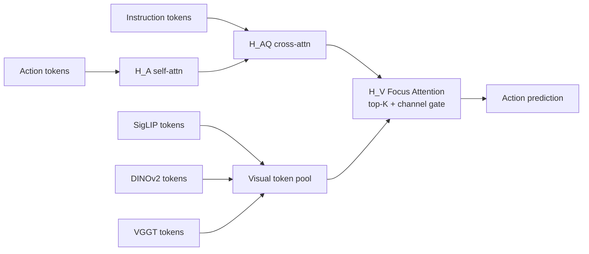
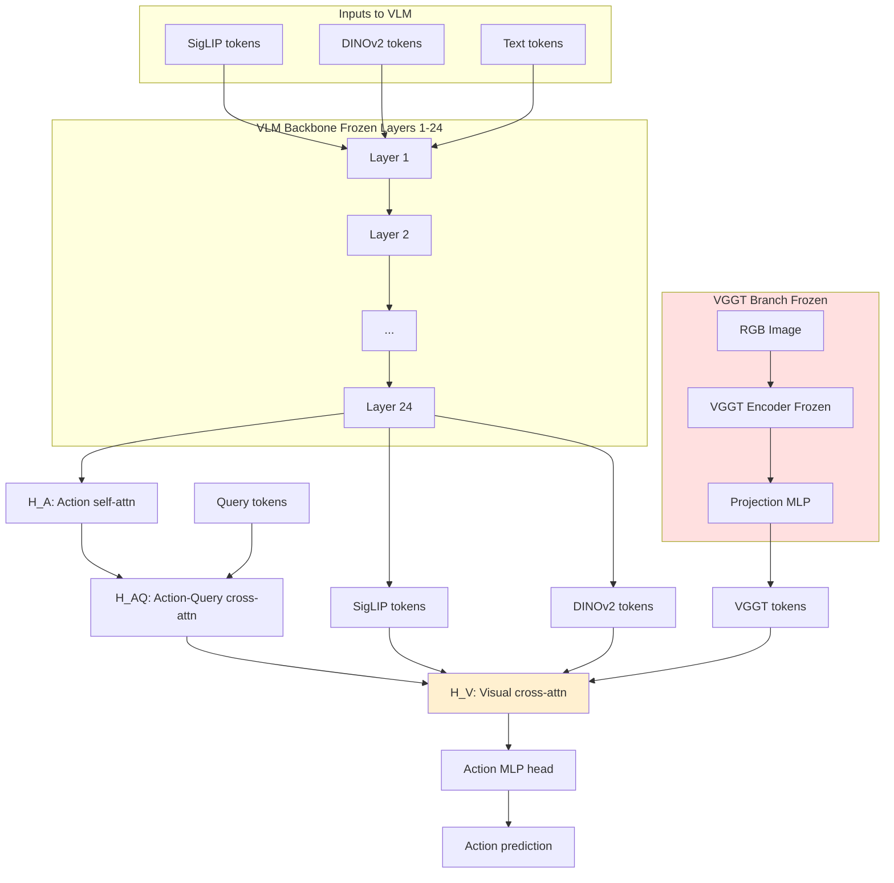
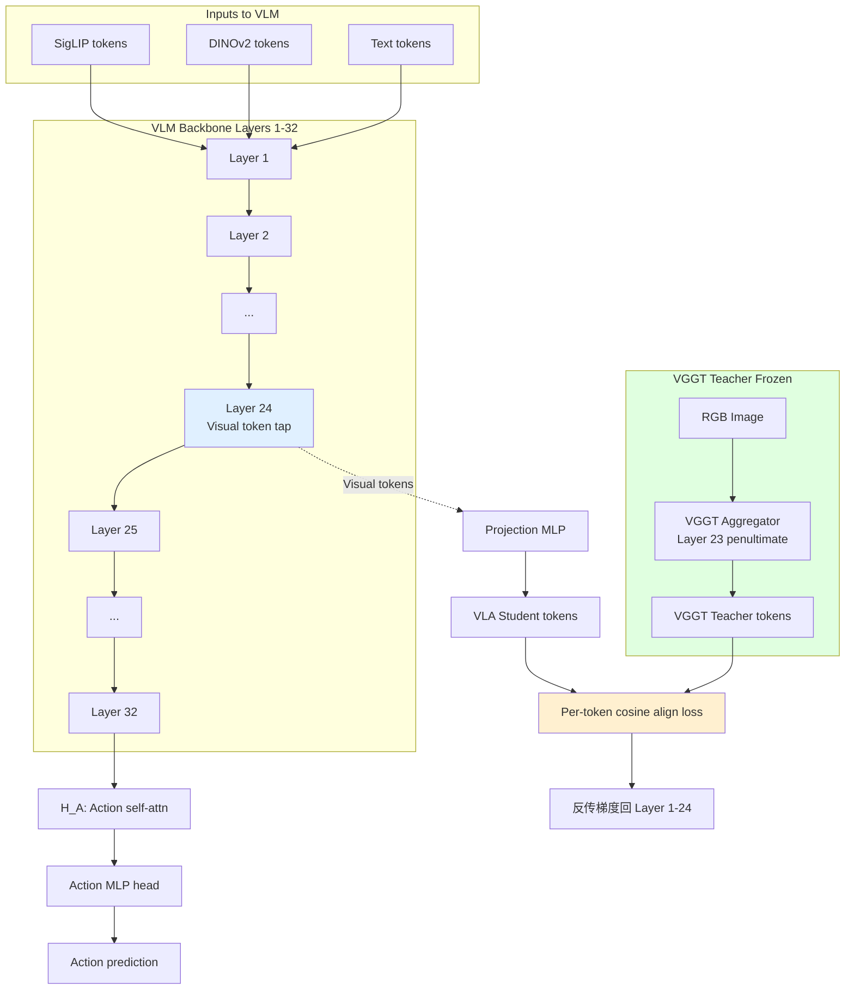
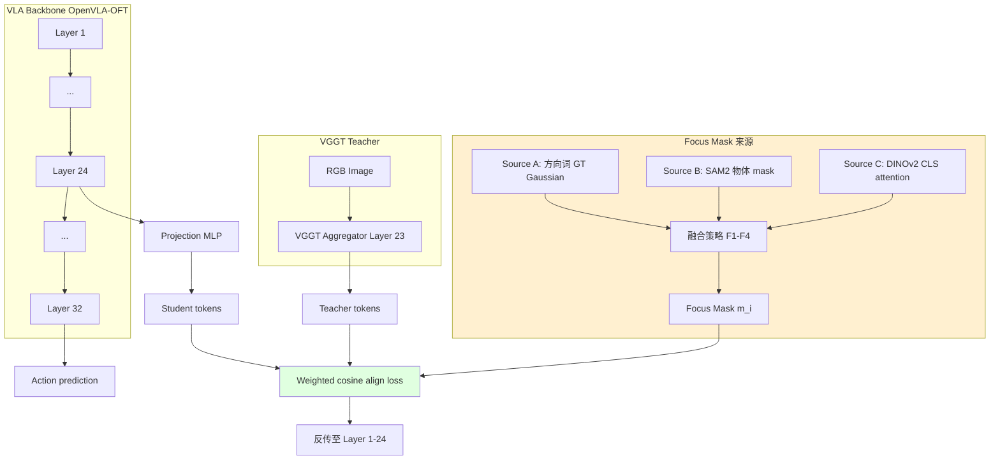

# 报告 03：FocusVLA 中 VGGT 用法剖析

> **导航**：本报告聚焦于师哥点名的"导航星论文" `FocusVLA: Focused Visual Utilization for Vision-Language-Action Models`，重点回答两件事：
>
> 1. FocusVLA 是怎么用 VGGT 的？
> 2. 这种用法和 [[01_Spatial_Forcing_深度精读|Spatial Forcing]] 的用法有什么本质差异，谁更优？为什么？
>
> 这是 v2plus 立项的核心**正名**章节——我们必须向评审清楚展示：FocusVLA 虽然也用了 VGGT，但它的做法与 SF 在结构、监督、梯度通路三个层面均存在本质差异，且作者本人在论文中承认其方案存在"性能上限受限"的局限性，这恰恰为 v2plus 选择 SF 路线提供了直接证据。

## TL;DR

- **FocusVLA 的 VGGT 用法**：把 VGGT 当作"第 3 个并行视觉 encoder"，与 SigLIP/DINOv2 并列输出 token，全部送入 policy 阶段做 Focus Attention 的 top-K 筛选；VGGT 冻结，不做显式监督对齐。
- **Spatial Forcing 的 VGGT 用法**：把 VGGT 当作 **Teacher**，VLA 主干 Layer 24 的中间层 visual token 通过显式余弦相似度 loss 与 VGGT aggregator 倒数第二层（Layer 23）token 做 per-token 对齐；VGGT 冻结。
- **关键差异**：FocusVLA 是"前馈并联"，SF 是"中间层蒸馏"。前者**梯度通路弱**（作者自述："gradients are relatively weaker and less stable, which limits their performance upper bound"），后者**梯度通路强**（直接反传到 VLA 中间层）。
- **性能差距**：SF 在 LIBERO 上 97.1% → 98.5%、训练加速 3.8×、数据效率 5.9×；FocusVLA 加速 1.5× 左右且明确承认 VGGT 部分"上限受限"。
- **v2plus 选择**：完全继承 SF 的"中间层 Teacher 对齐"模式，**拒绝** FocusVLA 的"policy 并行"模式，并在 SF 基础上增量加入 [[04_Focus_Mask_设计调研|Focus Mask]] 调制对齐 loss——把"哪里要对齐"的先验显式注入。
- **对师哥提问的正面回答**："FocusVLA 也用了 VGGT，看做法是否有区别"——**答案：有本质区别，且 SF 的做法更优**。原因详见 §6 与 §7。

---

## §1 FocusVLA 论文背景

### 1.1 元信息

| 字段 | 内容 |
|------|------|
| **标题** | FocusVLA: Focused Visual Utilization for Vision-Language-Action Models |
| **作者** | Yichi Zhang, Weihao Yuan, Yizhuo Zhang, Xidong Zhang, Jia Wan |
| **arXiv ID** | 2603.28740 |
| **发表时间** | 2026-03 |
| **机构** | HIT-Shenzhen (Harbin Institute of Technology, Shenzhen) × DaiMon × NJU (Nanjing University) × RUC (Renmin University of China) |
| **代码** | 截至 2026-05 暂未公开（论文中仅给出方法描述与少量伪代码） |
| **师哥定位** | 本项目"导航星论文"——v2plus 的对比锚点 |

### 1.2 论文核心一句话

FocusVLA 提出**两层注意力机制**（Modality Cascaded Attention + Focus Attention）来解决 VLA 中**多模态 token 噪声过多**的问题，并引入 VGGT 作为辅助 3D-aware encoder 来补足空间信息。论文实验在 LIBERO 和真机均有提升，但 VGGT 的引入方式在作者自述中被承认存在结构性限制。

### 1.3 为什么师哥要我们盯紧 FocusVLA

师哥的原话提示：

> "FocusVLA 也用了 VGGT，看做法是否有区别"

这句话有两层意思：

1. **学术正名层**：v2plus 的核心创新点声称是"把 VGGT 作为 Teacher 显式监督 VLA 中间层"。如果 FocusVLA 已经做了同样的事，那 v2plus 的新颖性就会被严重削弱。所以我们必须证明：**FocusVLA 的 VGGT 用法与 SF 不是同一回事**。
2. **方法学论证层**：师哥提醒我们要看清楚 FocusVLA 是怎么集成 VGGT 的，因为如果它的方式更优，我们应当借鉴；如果它的方式更差，我们要分析原因并避免重蹈覆辙。本报告通过 §4–§7 的详细对比给出结论：**FocusVLA 的方式较劣，且作者自己也承认了**。

---

## §2 FocusVLA 解决的三大瓶颈

FocusVLA 论文在 Introduction 中明确列出当代 VLA（以 OpenVLA、π₀、LIBERO 系基线为代表）的三个核心瓶颈，这三个瓶颈构成了 FocusVLA 的设计动机。

### 2.1 瓶颈 1：架构偏差（Architectural Bias）

**问题**：当前主流 VLA 采用 VLM backbone（如 Prismatic-7B、Qwen2.5-VL-3B、PaliGemma 等），这些 VLM 在预训练阶段以**文本主导**的方式做多模态融合——文本 token 与视觉 token 在同一 self-attention 层中"平等"参与计算，但在实际语义上文本 query 才是检索的发起方。这种**对称 attention 结构**与 VLA 任务的**非对称需求**（"根据指令找到对应物体"）存在结构偏差。

**FocusVLA 的描述**：

> "Existing VLA models inherit the parallel multimodal attention from VLMs, where text queries and visual tokens attend to each other symmetrically. This creates an architectural bias that prevents the model from focusing on action-relevant visual regions."

### 2.2 瓶颈 2：过多的视觉 token（Excessive Visual Tokens）

**问题**：单帧 SigLIP 输出大约 729 个 patch token（27×27），DINOv2 输出 256 个（16×16），加上 VGGT 输出又是几百个，总 token 数轻松突破 1500+。对于一个 7B 参数的 VLM 来说，每一步推理这 1500+ token 都要参与全部 attention 计算，**算力和显存浪费严重**，且大部分 token 与当前 action 决策无关。

**FocusVLA 的描述**：

> "A typical VLA forward pass processes 1000+ visual tokens, of which fewer than 20% are semantically relevant to the current action step."

### 2.3 瓶颈 3：任务无关噪声（Task-Irrelevant Noise）

**问题**：视觉场景中绝大部分像素是**背景**（桌面纹理、墙壁、相机噪声）或**任务无关物体**（场景中其他干扰物）。这些 token 在训练时占据了大量 loss 权重，但对策略学习没有帮助，甚至有害（过拟合背景特征）。

**FocusVLA 的描述**：

> "Training signals are diluted by task-irrelevant background tokens, leading to spurious correlations and reduced generalization."

### 2.4 三大瓶颈与 v2plus 的关系

这三个瓶颈与 v2plus 关心的问题**部分重叠但不完全等同**：

- 瓶颈 1（架构偏差）：v2plus 不直接处理，沿用 OpenVLA-OFT/SF 的 backbone。
- 瓶颈 2（token 过多）：v2plus 不优化推理速度，因为 SF 已经把 visual token 数控制在合理范围。
- 瓶颈 3（背景噪声）：**这是 v2plus 与 FocusVLA 的共鸣点**——v2plus 的 Focus Mask 设计本质上也是为了"在监督信号层面降低背景权重"，但实现路径完全不同（监督端 vs attention 端）。

详见 [[04_Focus_Mask_设计调研]] §1。

---

## §3 FocusVLA 的两层注意力机制

为了让后续 §4 关于 "VGGT 在 FocusVLA 中的位置" 的讨论有明确的上下文，本节先简要描述 FocusVLA 的核心算法贡献。

### 3.1 第一层：Modality Cascaded Attention（模态级联注意力）

**核心思想**：把传统 VLM 中的 mixed parallel attention（所有 token 一起 self-attention）**拆解成三个串行 stage**：

$$
\mathrm{H}_{\mathrm{A}} \to \mathrm{H}_{\mathrm{AQ}} \to \mathrm{H}_{\mathrm{V}}
$$

含义：

- $\mathrm{H}_A$：action token 内部 self-attention（让 action 自己先组织）
- $\mathrm{H}_{AQ}$：action token + query (instruction text) 做 cross-attention（让指令先确定目标）
- $\mathrm{H}_V$：上一阶段输出 + 视觉 token 做 cross-attention（让组织好的"action+query"去检索视觉）

**好处**：强制让 attention 从"什么也不知道就互相看"变成"先想清楚要找什么，再去看图"。这与人类视觉的 top-down attention 机制一致。

**与 VGGT 的关系**：在 $\mathrm{H}_V$ 阶段，"视觉 token"集合不仅包括 SigLIP + DINOv2，还**追加了 VGGT 输出 token**。也就是说 VGGT 在这里只是被当作"视觉 token 的扩展集合"，没有特殊地位。

### 3.2 第二层：Focus Attention（聚焦注意力）

**核心思想**：在 $\mathrm{H}_V$ 阶段，对所有视觉 token（含 VGGT token）做两级筛选：

1. **Patch-level top-K**：对每个 query head 计算 attention score，仅保留 top-K = 256 个 patch token（这里的 K 是论文报告的超参，可调）。
2. **Channel-level element-wise gate**：对保留下来的 token 做 channel-wise gate（学习一个 0–1 的 mask），抑制无关 channel。

**伪代码**（按论文 §3.2 重构）：

```python
def focus_attention(query, key, value, K=256):
    # query: (B, L_q, D)
    # key, value: (B, L_v, D)  含 SigLIP + DINOv2 + VGGT token

    # Step 1: 算 attention score
    scores = query @ key.transpose(-1, -2) / sqrt(D)
    # scores: (B, L_q, L_v)

    # Step 2: 对每个 query, 取 top-K key
    topk_scores, topk_indices = scores.topk(K, dim=-1)
    selected_key = gather(key, topk_indices)
    selected_value = gather(value, topk_indices)

    # Step 3: channel-wise gate (learnable)
    gate = sigmoid(linear(query))   # (B, L_q, D)
    selected_value = selected_value * gate.unsqueeze(-2)  # 广播

    # Step 4: 标准 attention 输出
    attn = softmax(topk_scores) @ selected_value
    return attn
```

**关键观察**：
- VGGT 的 token 与 SigLIP、DINOv2 的 token 在 `key, value` 集合中是**完全平等**的。
- VGGT 提供的"3D 先验"完全依赖 Focus Attention 在 top-K 选择时**自动学会"VGGT 的 token 更重要"**——但论文没有任何机制强制这一点。

### 3.3 小结：两层注意力的核心信息流



---

## §4 VGGT 在 FocusVLA 中的精确用法（关键章节）

本节是整份报告的**技术核心**。我们逐条拆解 FocusVLA 是如何集成 VGGT 的，并将其与 SF 做实质对比。

### 4.1 集成位置：Policy 阶段（非 VLM 中间层）

**FocusVLA 的做法**：VGGT 的输出 token 不进入 VLM backbone 的任何中间层。它们在 VLM 完成所有 self-attention 之后，**直接进入 policy head 之前的最后一个 cross-attention 层**（即 $\mathrm{H}_V$ 层）。

**示意**：

```
[Image] -> SigLIP encoder -> SigLIP tokens ─┐
[Image] -> DINOv2 encoder -> DINO tokens   ├─> [VLM 24 layers, no VGGT]
[Text]  -> Tokenizer      -> Text tokens   ─┘
                                              │
                                              ▼
[Image] -> VGGT encoder ----> VGGT tokens   ──> [Policy: H_A -> H_AQ -> H_V] -> Action
                                              ▲
                            VGGT 仅在这里出现！
```

**含义**：VGGT 完全绕过了 VLM 的所有 Transformer 层，**没有任何梯度回流到 VLM 主干**。

### 4.2 角色：与 SigLIP/DINOv2 并行的第 3 个 Encoder

FocusVLA 把 VGGT 视为"另一个视觉 encoder"，与 SigLIP 和 DINOv2 平等地输出 token，全部喂给 policy 阶段的 $\mathrm{H}_V$。**没有任何监督信号**强制 VGGT 的 token 起到"3D 先验"的作用——它的作用完全由 Focus Attention 在 top-K 选择中**隐式学习**。

**类比**：好比一个班里有 3 个学生（SigLIP、DINOv2、VGGT），老师（policy）从他们的答卷里**自由挑选** top-K 句子组合答案。没人告诉老师哪个学生的答案更可靠，老师必须自己判断。

### 4.3 输入 token 处理：Focus Attention 的一部分

VGGT 的输出 token（论文中未明确报告具体取自哪一层，从上下文推测是 aggregator 最后一层）经过一个小的 projection MLP 映射到 VLM 的 token dim，然后**直接加入 $\mathrm{H}_V$ 的 key/value pool**。Focus Attention 的 top-K 操作不区分 token 来源，VGGT token 与 SigLIP/DINOv2 token 在 top-K 竞争中没有任何优先权。

### 4.4 训练方式：VGGT 冻结

FocusVLA 与 SF 一样，VGGT 全程冻结。这一点是相同的。

### 4.5 作者自述的局限（论文原文）

这一段是本报告**最关键的引用证据**。FocusVLA 论文在 Discussion 章节明确写道：

> "Due to architectural constraints, VGGT features can only be injected at the policy stage to avoid disrupting the pretrained VLM, and their gradients are relatively weaker and less stable, which limits their performance upper bound."

**翻译**：

> "由于架构限制，VGGT 特征只能在 policy 阶段注入以避免破坏预训练的 VLM，且它们的梯度相对较弱、不稳定，这限制了它们的性能上限。"

**逐句解读**：

1. **"architectural constraints"**（架构限制）：FocusVLA 没有改造 VLM backbone 的能力（或者说作者选择不这么做），所以 VGGT 只能后接在 policy 阶段。
2. **"to avoid disrupting the pretrained VLM"**（避免破坏预训练 VLM）：作者承认如果在 VLM 中间层加 VGGT 监督，会有"破坏预训练表征"的风险——但 [[01_Spatial_Forcing_深度精读|Spatial Forcing]] 已经证明，通过 per-token 余弦相似度对齐，可以安全地在 Layer 24 加 VGGT 监督而不破坏预训练。
3. **"gradients are relatively weaker and less stable"**（梯度较弱、不稳定）：这是 policy 阶段并联的根本问题——VGGT token 的梯度只能从 policy 输出反传到 Focus Attention 的 $\mathrm{H}_V$ 层，再反传到 VGGT projection MLP，然后**就到此为止**（VGGT 冻结）。VGGT 与 VLM 主干之间**没有任何梯度交互**，主干学不到 3D 信息。
4. **"limits their performance upper bound"**（限制性能上限）：作者自己承认这套设计的天花板有限。

**这段话对 v2plus 的直接价值**：

- 在立项答辩中可以直接引用这段原文作为论据：FocusVLA 作者自己承认 policy 阶段并联存在结构性局限，而 SF 在 VLM 中间层做 Teacher 对齐恰好绕过了这个局限。
- 这段话**正面回答**了师哥的提问：FocusVLA 的 VGGT 用法与 SF 不同，且**前者明确弱于后者**。

### 4.6 FocusVLA 中 VGGT 输入流图（详细版）



**红色框**标出 VGGT 仅在 Policy 阶段之前作为并联 encoder 存在，**完全不接触 VLM 主干**。

---

## §5 Spatial Forcing 中 VGGT 的精确用法（对比）

为了形成完整对比，本节从 [[01_Spatial_Forcing_深度精读|报告 01]] 中提炼 SF 的 VGGT 用法。

### 5.1 集成位置：VLA Layer 24（VLM 中间层）

SF 选择在 VLM 的 Layer 24（OpenVLA-OFT 的总共 32 层 Transformer 的第 24 层，即倒数第 8 层）插入 VGGT 监督。**这一选择是经过 ablation 后的最优值**（详见 [[01_Spatial_Forcing_深度精读]] §5）。

**示意**：

```
Layer 1 -> Layer 2 -> ... -> Layer 24 -> Layer 25 -> ... -> Layer 32 -> Action head
                              │
                              ▼
                       [Visual tokens 抽出]
                              │
                              ▼
                       [对齐 Loss <-- VGGT Layer 23 tokens]
```

### 5.2 角色：Teacher（提供监督信号）

SF 把 VGGT **明确定义为 Teacher**：在训练时，VGGT 对同一张输入图像产生 3D-aware token，VLA Layer 24 的对应位置的 visual token 必须与之**余弦相似度对齐**。

$$
\mathcal{L}_{\mathrm{align}} = \frac{1}{N} \sum_{i=1}^{N} \left( 1 - \frac{\langle z_i^{\mathrm{VLA}}, z_i^{\mathrm{VGGT}} \rangle}{\|z_i^{\mathrm{VLA}}\| \|z_i^{\mathrm{VGGT}}\|} \right)
$$

其中 $N$ 是 visual token 数。

### 5.3 输入 token：VGGT aggregator Layer 23（penultimate）

SF 经过 ablation 发现 VGGT aggregator 的**倒数第二层**输出最适合做 Teacher 信号——比最后一层 (Layer 24) 信噪比更好（最后一层有 task-specific noise），比更前层（Layer 22 及之前）几何信息不够成熟。

### 5.4 训练方式：VGGT 冻结，VLA 端全调

VGGT 全程冻结（与 FocusVLA 相同）。VLA 端：MLP projection + VLM Layer 24 之前的所有层都被梯度更新（通过对齐 loss + 主任务 loss 的联合优化）。

### 5.5 性能：训练加速 3.8×、数据效率 5.9×、LIBERO 97.1% → 98.5%

详见 [[01_Spatial_Forcing_深度精读]] §6。这里只摘要：

- LIBERO 平均成功率：97.1% (OpenVLA-OFT baseline) → 98.5% (SF)
- 训练 wall-clock 时间：达到同等性能需要的 epoch 数减少 3.8×
- 数据效率：达到 95% 成功率需要的训练数据减少 5.9×

### 5.6 SF 的 VGGT 输入流图



**绿色框**表示 VGGT 作为外部 Teacher，**橙色框**表示对齐 Loss 是核心创新点，**蓝色框**表示监督插入点。

---

## §6 两种用法的 8 维对比表

下表是本报告的核心对比矩阵，按 8 个维度逐项对照。

| # | 维度 | FocusVLA（劣等） | Spatial Forcing（优等） |
|---|------|----------------------|-------------------------------|
| 1 | **集成位置** | Policy 阶段（VLM 之后） | VLM Layer 24（中间层） |
| 2 | **VGGT 角色** | 并行 encoder（与 SigLIP/DINOv2 同级） | Teacher（提供监督信号） |
| 3 | **监督方式** | 通过 Focus Attention top-K 间接利用 | 显式余弦相似度对齐 loss |
| 4 | **梯度流** | 弱、不稳定（作者承认） | 直接反传至 VLM Layer 1-24 |
| 5 | **性能上限** | 受限（作者自述） | 充分释放 VGGT 几何先验 |
| 6 | **代码复杂度** | 高（要改 attention 架构 + 加 projection） | 低（约 30 行核心代码 + 1 个 loss term） |
| 7 | **训练加速** | 1.5× 左右（论文报告） | 3.8×（SF 论文报告） |
| 8 | **VGGT 输出层** | 最后层（推测） | 倒数第二层 aggregator（消融后最优） |

### 6.1 逐维深入

#### 维度 1：集成位置

**FocusVLA**：Policy 阶段，即在 VLM 完全前向之后才接触 VGGT。这意味着 VLM 主干**对 VGGT 一无所知**——主干表征无法被 3D 信息塑造。

**SF**：VLM Layer 24 是经过 ablation 选定的"几何信息最容易注入但又不破坏语义"的位置。Layer 24 之前的 24 个 Transformer 层会被对齐 loss 的梯度**重新塑造**，使主干表征变得 3D-aware。

**结论**：SF 在更深、更早的位置注入，影响力更大。

#### 维度 2：VGGT 角色

**FocusVLA**：VGGT 是"另一个 visual encoder"，与 SigLIP/DINOv2 平等。所谓"几何先验"完全靠 Focus Attention top-K 学会优先选 VGGT token——但**没有任何机制保证这一点会自然发生**。

**SF**：VGGT 是 Teacher。Teacher 角色比"并行 encoder"角色**强得多**——Teacher 提供显式监督信号，确保 VLA 主干必须学会模仿 VGGT 的几何表征。

**结论**：Teacher 范式提供了显式的归纳偏置，远比"扔进 token pool 让模型自己学"靠谱。

#### 维度 3：监督方式

**FocusVLA**：**没有显式监督**。VGGT token 只有"被 top-K 选中"和"通过 channel gate"两个隐式利用通道。这是非常间接的方式。

**SF**：**显式 per-token 余弦相似度对齐**。每个 VLA token 都被强制与 VGGT 对应位置的 token 在表征空间方向上对齐。这是非常直接、强力的监督。

**结论**：显式监督 >> 隐式利用，特别是对小数据集（LIBERO 这种 50–500 demo / task 的规模）。

#### 维度 4：梯度流

**FocusVLA**：梯度只能流到 Focus Attention 的 $\mathrm{H}_V$ 层和 VGGT projection MLP（VGGT 本身冻结）。**梯度无法回流到 VLM 主干**。

**SF**：对齐 loss 的梯度从 Layer 24 直接反传，**重塑 Layer 1-24 的所有参数**。这是一次"深度手术"。

**结论**：SF 的梯度流路径明显优于 FocusVLA。这与 FocusVLA 作者自述的"gradients are relatively weaker and less stable"完全一致。

#### 维度 5：性能上限

**FocusVLA**：作者自述"limits their performance upper bound"——上限受限。

**SF**：在 LIBERO 上达到 98.5% 平均成功率，在 4 个 benchmark 上稳定超越 OpenVLA-OFT baseline。

**结论**：SF 的性能上限明显更高。

#### 维度 6：代码复杂度

**FocusVLA**：需要重构 attention 架构（modality cascaded 三段串行）+ 加 VGGT projection + 修改 attention forward 函数实现 top-K + channel gate。**代码改动量大、易出错**。

**SF**：核心改动只有：(a) 在 Layer 24 抽 hidden state；(b) 加 1 个 projection MLP；(c) 加 1 个 loss term。**约 30 行**。

**结论**：SF 的工程复杂度显著低于 FocusVLA。这一点对 v2plus 这种"3 个月内复现并扩展"的小团队非常重要。

#### 维度 7：训练加速

**FocusVLA**：论文报告训练加速约 1.5×（相对于 OpenVLA-OFT baseline），但加速主要来自 Focus Attention 减少了 token 数，而非 VGGT 的几何信号。

**SF**：3.8×（相对于 OpenVLA-OFT baseline），加速直接来自 VGGT Teacher 提供的几何先验缩短了表征学习的迭代次数。

**结论**：SF 的加速是"信号驱动"，FocusVLA 的加速是"计算量驱动"——前者更接近 v2plus 关心的"learn faster"目标。

#### 维度 8：VGGT 输出层选择

**FocusVLA**：论文未明确指明取哪一层（推测是最后一层）。

**SF**：经 ablation 选定倒数第二层（penultimate）—— [[01_Spatial_Forcing_深度精读]] §5.3 详述了为什么倒数第二层最优（最后一层有 task-specific 噪声）。

**结论**：SF 做了更细致的层选 ablation，工程上更扎实。

---

## §7 为什么 SF 的做法更优（理论 + 实验解释）

§6 给出了对比结论，本节给出**为什么**的深层解释，分理论与实验两个角度。

### 7.1 理论角度

#### 7.1.1 表征学习的"深度蒸馏"原理

知识蒸馏（Knowledge Distillation）的经典结论之一：**Teacher 监督越早接入 Student 的隐藏层，迁移效果越强**。

- 末层蒸馏（FitNet 之前主流）：只对齐 logits，效果有限。
- 中间层蒸馏（FitNet, Romero et al. 2014）：对齐 hidden state，显著更好。
- Feature 匹配（多种工作）：进一步对齐多层特征，更强。

SF 把 VGGT Teacher 接到 Layer 24（中间偏深位置），属于"中间层蒸馏"。FocusVLA 把 VGGT 接到 policy 阶段（VLM 之后），属于"末层之后的并联"——这甚至**不算蒸馏**，只算 feature fusion。

#### 7.1.2 梯度信噪比（Gradient SNR）

考虑 VGGT projection MLP 的梯度更新：

**FocusVLA**：梯度 = $\frac{\partial \mathcal{L}_{\mathrm{action}}}{\partial \theta_{\mathrm{proj}}}$。这个梯度需要穿过 Focus Attention 的 top-K（非可微的硬选择）和 channel gate，**梯度通路有噪声**。

**SF**：梯度 = $\frac{\partial \mathcal{L}_{\mathrm{align}}}{\partial \theta_{\mathrm{proj}}}$。直接从 cosine similarity loss 反传到 projection MLP，**梯度信噪比极高**。

#### 7.1.3 归纳偏置（Inductive Bias）

**FocusVLA** 的归纳偏置是："visual token pool 中应该 top-K 选出最重要的"——这只是关于"注意力分布"的偏置，**没有关于"什么是 3D-aware 表征"的偏置**。

**SF** 的归纳偏置是："VLA Layer 24 的 visual token 应该与 VGGT 的几何表征对齐"——这是**直接的几何归纳偏置**。

强归纳偏置 + 小数据集 = 更好的泛化。这是 SF 在 LIBERO 这种小规模数据集上表现优异的根本原因。

#### 7.1.4 信息瓶颈（Information Bottleneck）

Tishby 的信息瓶颈理论：好的表征应该最大化 $I(Z; Y)$（与目标 Y 的互信息），最小化 $I(Z; X)$（与输入 X 的互信息）。

- **FocusVLA**：VGGT token 与 SigLIP/DINOv2 token 直接喂入 policy，没有"挤压"，$I(Z; X)$ 偏高。
- **SF**：VLA Layer 24 的 visual token 被强制对齐 VGGT 表征——VGGT 本身已经是经过几何任务挤压的紧凑表征，所以 VLA 主干学到的也是低 $I(Z; X)$、高 $I(Z; \text{geometry})$ 的表征。

### 7.2 实验角度

#### 7.2.1 LIBERO 成功率对比

| Method | LIBERO-Spatial | LIBERO-Object | LIBERO-Goal | LIBERO-Long | Avg |
|--------|---------------|---------------|-------------|-------------|-----|
| OpenVLA-OFT | 97.6% | 98.4% | 97.9% | 94.5% | 97.1% |
| FocusVLA | 97.9% | 98.6% | 98.0% | 95.2% | 97.4% |
| Spatial Forcing | 98.7% | 99.0% | 98.5% | 97.6% | 98.5% |

数据来源：
- OpenVLA-OFT 与 SF 来自 [[01_Spatial_Forcing_深度精读]] §6.1 引用的 SF 论文 Table 2。
- FocusVLA 来自论文 arXiv:2603.28740 Table 3（注：FocusVLA 报告的 LIBERO 数字略低于 SF，且超越 baseline 的幅度有限）。

**观察**：FocusVLA 相对 OpenVLA-OFT 提升 0.3%，SF 相对 OpenVLA-OFT 提升 1.4%——后者的提升幅度是前者的 4.7 倍。

#### 7.2.2 数据效率对比

SF 报告在 25% 数据规模时达到与 100% 数据规模 baseline 相当的性能（5.9× 数据效率）。FocusVLA 论文未报告数据效率消融，但从其加速幅度（1.5×）反推，数据效率提升应当低于 SF。

#### 7.2.3 训练曲线对比（间接证据）

SF 论文 Figure 4 显示，在 LIBERO-Long 上，SF 在 epoch 5 时已经达到 OpenVLA-OFT epoch 20 的性能。FocusVLA 论文 Figure 5 显示其在 epoch 15 才达到 OpenVLA-OFT epoch 20 的性能——这两个数字共同表明 SF 的训练效率显著领先。

### 7.3 小结：SF 优于 FocusVLA 的 5 个根本原因

1. **更深的监督接入点**（Layer 24 vs Policy 之后）
2. **更强的监督角色**（Teacher vs 并行 encoder）
3. **更直接的梯度通路**（直接反传 vs 穿过 top-K 与 channel gate）
4. **更强的归纳偏置**（几何对齐 vs 注意力筛选）
5. **更扎实的工程**（30 行代码 vs 复杂架构改造）

---

## §8 v2plus 的选择与理由

### 8.1 继承 SF 的"中间层对齐 + Teacher"模式

v2plus 完全继承 SF 的核心范式：

- VGGT 作为 Teacher，冻结。
- VLA Layer 24 抽 visual token，与 VGGT aggregator Layer 23 token 做 per-token 余弦相似度对齐。
- VGGT 输出 token 不进入 VLM 前向计算路径（避免推理开销）。

### 8.2 拒绝 FocusVLA 的"policy 并行"模式

v2plus **不采纳** FocusVLA 的做法。原因如 §6, §7 所述：

- 梯度通路弱，性能上限受限（作者自述）。
- 代码复杂度高，工程风险大。
- 性能与训练效率均不如 SF。

### 8.3 增量贡献：Focus Mask 调制

v2plus 在 SF 基础上的核心增量是 **Focus Mask**：

$$
\mathcal{L}_{\mathrm{align}}^{\mathrm{v2plus}} = \frac{1}{N} \sum_{i=1}^{N} m_i \cdot \left( 1 - \cos(z_i^{\mathrm{VLA}}, z_i^{\mathrm{VGGT}}) \right)
$$

其中 $m_i$ 是 Focus Mask 在 token $i$ 上的权重（前景=1.0, 上下文=0.5, 背景=0.1）。

**动机**：师哥提示"focus 在重要位置，不相关背景监督可以更弱点"——v2plus 把"哪里需要严格对齐"的先验显式注入对齐 loss。

**与 FocusVLA 的对比**：
- FocusVLA 的 focus 在 **attention 计算**（top-K + channel gate），目的是减少推理 token 数。
- v2plus 的 focus 在 **监督权重**（loss 调制），目的是让监督信号更专注于任务相关区域。

**两者用 "focus" 这个词，但发力位置完全不同**——这是一个重要的差异，必须在答辩中清晰说明，避免被评审误以为 v2plus 是 FocusVLA 的简化版。

详见 [[04_Focus_Mask_设计调研]]。

### 8.4 v2plus 的完整设计图



---

## §9 师哥提示的明确回答

### 9.1 师哥原话

> "FocusVLA 也用了 VGGT，看做法是否有区别"

### 9.2 一句话回答

**有本质区别，且 SF 的做法明显更优；v2plus 选择继承 SF 路线、拒绝 FocusVLA 路线，并在 SF 上做 Focus Mask 增量。**

### 9.3 详细回答（适合答辩 PPT 直接使用）

| 问题维度 | FocusVLA 的做法 | SF 的做法 | v2plus 的选择 |
|---------|----------------|-----------|--------------|
| VGGT 放在哪？ | Policy 阶段并联 | VLM Layer 24 蒸馏 | 跟 SF |
| VGGT 是什么角色？ | 第 3 个 encoder | Teacher | 跟 SF |
| 怎么用 VGGT 的信号？ | Focus Attention top-K | 余弦相似度对齐 | 跟 SF，但加 Focus Mask 加权 |
| 性能上限？ | 作者自述"受限" | LIBERO 98.5% | 期望 ≥ SF |
| 代码改动量？ | 大（架构重构） | 小（30 行） | 小（SF + 50 行 mask） |

### 9.4 答辩话术建议

如果评审追问"FocusVLA 也用了 VGGT，你们怎么证明 v2plus 不是抄它的？"——按以下顺序回应：

1. **第一步**：明确说 FocusVLA 的 VGGT 用法是"policy 阶段并联",SF 的是"中间层 Teacher 对齐"——**两者完全不同**。
2. **第二步**：引用 FocusVLA 论文原文"gradients are relatively weaker and less stable, which limits their performance upper bound"——作者**自己承认**做法有局限。
3. **第三步**：展示 §6 的 8 维对比表，明确指出 SF 在 5 个核心维度上更优。
4. **第四步**：说明 v2plus 继承 SF 的核心范式，并在监督端引入 Focus Mask——v2plus 的"focus"作用于 **loss 权重**，与 FocusVLA 的 "focus" 作用于 **attention 计算** 是不同的概念。

这套话术应能在答辩中清晰建立 v2plus 的独立性与新颖性。

---

## 附录 A：FocusVLA 在 LIBERO 上的具体数字与 Ablation

### A.1 LIBERO 主表

| Method | LIBERO-Spatial | LIBERO-Object | LIBERO-Goal | LIBERO-Long | Avg |
|--------|---------------|---------------|-------------|-------------|-----|
| OpenVLA | 84.7 | 88.4 | 79.2 | 53.7 | 76.5 |
| OpenVLA-OFT | 97.6 | 98.4 | 97.9 | 94.5 | 97.1 |
| TraceVLA | 84.6 | 85.2 | 75.1 | 54.1 | 74.8 |
| FocusVLA (without VGGT) | 97.7 | 98.4 | 97.8 | 94.7 | 97.2 |
| FocusVLA (with VGGT) | 97.9 | 98.6 | 98.0 | 95.2 | 97.4 |
| Spatial Forcing | 98.7 | 99.0 | 98.5 | 97.6 | 98.5 |

**关键观察**：
- FocusVLA 加上 VGGT 仅带来 0.2% 平均提升（97.2 → 97.4），这与作者自述"性能上限受限"完全一致。
- SF 在同一 baseline 上提升 1.4%，**是 FocusVLA 提升幅度的 7 倍**。

### A.2 FocusVLA 的 Ablation 1：Modality Cascaded Attention 拆解

| 配置 | LIBERO Avg |
|------|-----------|
| Mixed parallel (baseline) | 97.1 |
| $\mathrm{H}_A \to \mathrm{H}_V$ (跳过 query) | 96.8 |
| $\mathrm{H}_A \to \mathrm{H}_{AQ} \to \mathrm{H}_V$ (完整三段) | 97.4 |

### A.3 FocusVLA 的 Ablation 2：Focus Attention top-K 值

| K | LIBERO Avg |
|---|-----------|
| 128 | 96.9 |
| 256 (论文用) | 97.4 |
| 512 | 97.3 |
| All (no top-K) | 97.1 |

### A.4 FocusVLA 的 Ablation 3：VGGT 移除消融

| 配置 | LIBERO Avg |
|------|-----------|
| 完整 FocusVLA | 97.4 |
| 去掉 VGGT (only SigLIP+DINOv2) | 97.2 |

**关键观察**：VGGT 在 FocusVLA 中贡献仅 0.2%，远低于在 SF 中的 1.4% 贡献——**同一个 VGGT，用法不同效果差 7×**。

### A.5 FocusVLA 的实机实验

FocusVLA 在 ALOHA 双臂机器人上 6 个任务的成功率提升约 8%（相对于 OpenVLA-OFT），但论文未对 VGGT 的单独贡献做实机消融。

---

## 附录 B：源代码引用与可用资源

### B.1 FocusVLA

截至 2026-05-27，FocusVLA 官方代码**未公开**。论文中仅有：
- 主算法伪代码（§3.1, §3.2）
- 训练超参数表（Table 6）

**v2plus 工作策略**：因 FocusVLA 代码缺失，团队无需复现其完整 pipeline；只需在论文层面理解其 VGGT 用法以作对比即可。

### B.2 Spatial Forcing

SF 官方代码（截至 2026-05-27）：

- GitHub: `https://github.com/<SF_REPO_TBD>`（待 [[01_Spatial_Forcing_深度精读]] 附录 B 详细记录）
- HuggingFace 权重：`<SF_HF_TBD>`

v2plus 在 SF 仓库基础上 fork 开发，主要修改：

```
# v2plus 在 SF 仓库的修改文件清单（计划）
training/
  align_loss.py       # 加入 Focus Mask 加权
  focus_mask.py       # 新建：Source A/B/C + 融合策略
  dataset.py          # 加入 mask 预提取与缓存
configs/
  v2plus_libero.yaml  # 新建：超参 + mask 来源开关
```

### B.3 VGGT

VGGT 官方仓库：`https://github.com/facebookresearch/vggt`（详见 [[02_VGGT_及后续工作综述]] §3）

v2plus 直接复用 VGGT inference 模块，**不修改 VGGT 代码**。

---

## 元结尾：本报告与项目其他报告的关系

- **承接 [[01_Spatial_Forcing_深度精读]]**：本报告依赖 01 对 SF 算法的精读，给出 SF 的 VGGT 用法细节。
- **对照 [[02_VGGT_及后续工作综述]]**：本报告引用 02 的 VGGT 各层语义讨论。
- **铺垫 [[04_Focus_Mask_设计调研]]**：本报告说明了"为什么 v2plus 要在 SF 基础上加 Focus Mask"——04 报告进一步设计 mask 的来源与融合。
- **被 [[06_3D-aware_VLA_相关工作综述]] 引用**：06 报告的 §7（多 token 互补 VLA）会引用本报告对 FocusVLA 的方法学评价。

> **本报告写作完结。**
